# 1. Klasifikasi Gambar

Klasifikasi gambar adalah salah satu tugas penting dalam bidang computer vision yang bertujuan untuk `mengidentifikasi kategori atau kelas dari suatu gambar`. Tugas ini menjadi dasar dalam pengembangan teknologi seperti pengenalan wajah, deteksi objek, pengelompokan medis, dan aplikasi berbasis AI lainnya.

# 2. Neural Network

Neural Network (NN) adalah salah satu metode machine learning yang terinspirasi oleh cara kerja otak manusia. Untuk klasifikasi gambar, neural network digunakan untuk `mengenali pola-pola` tertentu dalam gambar sehingga dapat mengkategorikan gambar ke dalam kelas yang sesuai.

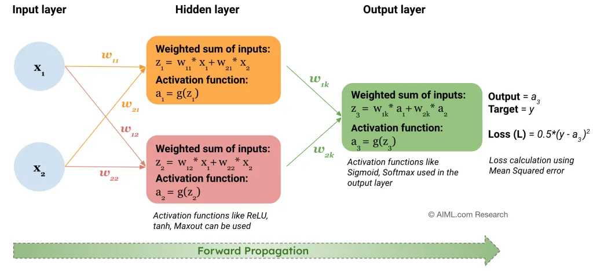

## 2.1 Konsep Dasar Neural Network
Neural network terdiri dari lapisan-lapisan (layers) yang saling terhubung. Setiap lapisan memiliki neuron yang memproses data melalui operasi matematis. Ada tiga jenis lapisan utama:

1. **Input Layer:** Menerima data mentah (gambar dalam bentuk piksel).
Contoh: Untuk gambar ukuran 28x28, input layer memiliki 784 neuron (28 x 28).


2. **Hidden Layer:** Melakukan proses komputasi dan ekstraksi fitur.
Terdiri dari beberapa lapisan yang terhubung melalui bobot (weights) dan bias. Aktivasi neuron dipengaruhi oleh fungsi aktivasi seperti ReLU, sigmoid, atau tanh.

    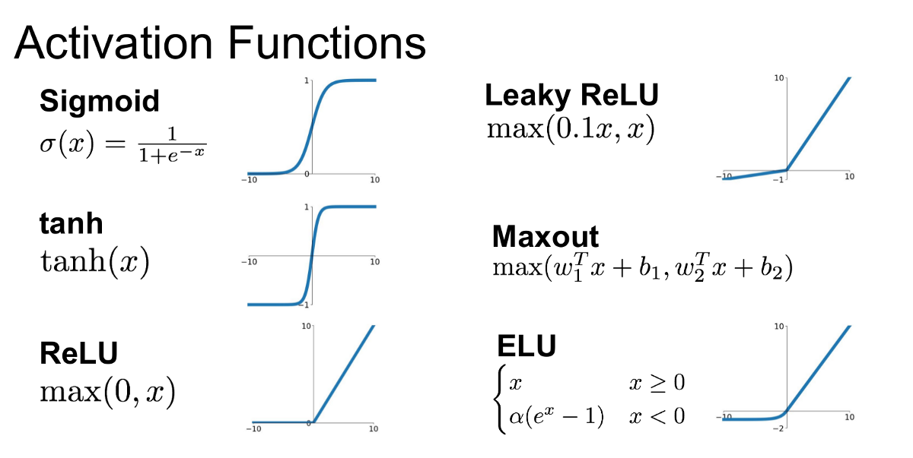

3. **Output Layer:** Memberikan hasil akhir berupa probabilitas atau label kelas. Jumlah neuron sesuai dengan jumlah kelas. Misalnya, untuk klasifikasi 10 kelas, output layer memiliki 10 neuron.

# 3. Alur Proses dari Neural Network
Neural Network (NN) bekerja melalui serangkaian tahapan yang saling terhubung untuk mempelajari pola dari data input dan menghasilkan prediksi. Berikut adalah penjelasan alur proses neural network:

1. **Data Input**: Data mentah (misalnya gambar, teks, atau angka) dimasukkan ke dalam neural network. Contoh Matriks piksel, misalnya 28×28 untuk gambar grayscale atau 28×28×3 untuk gambar RGB.

2. **Input Layer** : Lapisan pertama ini menerima data input tanpa melakukan komputasi dan meneruskannya ke lapisan berikutnya.

3. **Hidden Layer** : Hidden layers adalah bagian inti dari neural network yang bertanggung jawab untuk memproses data dan mengenali pola.

    - **Transformasi Linear** : Setiap neuron di hidden layer menghitung nilai linier dari input. 
    **Rumus:** z=∑(w⋅x)+b
        - **w:** Bobot (weight), yang menunjukkan pentingnya suatu input.
        - **x:** Nilai input dari neuron sebelumnya.
        - **b:** Bias, nilai tambahan untuk membantu model belajar lebih baik.
    - **Fungsi Aktivasi** : Non-linearitas diterapkan ke hasil transformasi linier untuk membantu model belajar pola yang kompleks.
    - **Penerusan Data ke Neuron Berikutnya :** Hasil dari fungsi aktivasi diteruskan ke lapisan berikutnya.

4. **Output Layer** : Memberikan predikso akhir dari model dengan jumlah neuron pada output layer bergantung pada jumlah kelas (untuk klasifikasi) atau satu nilai (untuk regresi).

5. **Loss Function** : Mengukur seberapa jauh prediksi model dari target sebenarnya dengan tujuan meminimalkan nilai loss agar model lebih akurat. 

6. **Backpropagation** : Proses untuk memperbaiki bobot dan bias berdasarkan error yang dihasilkan selama forward propagation dengan memperbarui paremeter bobot dan bias yang dikontrol oleh `optimizer` untuk memperbarui bobot agar konvergen lebih cepat.

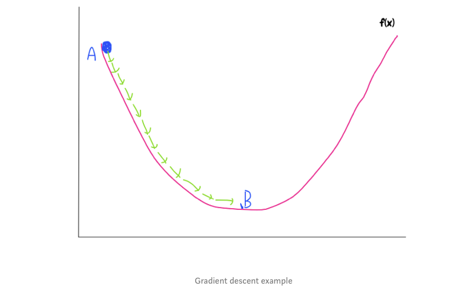

# 3. Deep Learning
Deep Learning (DL) adalah cabang dari Machine Learning yang menggunakan jaringan saraf tiruan (Artificial Neural Networks, ANN) dengan banyak lapisan (deep neural networks). DL dirancang untuk secara otomatis belajar dan mengekstrak fitur dari data mentah, seperti gambar, suara, atau teks, tanpa memerlukan langkah ekstraksi fitur manual.

3.1 **Perbedaan Utama Antara Machine Learning dan Deep Learning**

| **Aspek**                 | **Machine Learning (ML)**                                   | **Deep Learning (DL)**                                      |
|---------------------------|------------------------------------------------------------|-----------------------------------------------------------|
| **Definisi**              | Subset dari AI yang menggunakan algoritma untuk belajar dari data. | Subset dari ML yang menggunakan jaringan saraf dengan banyak lapisan. |
| **Ekstraksi Fitur**       | Dilakukan secara manual oleh manusia (domain expert).       | Dilakukan secara otomatis oleh jaringan.                  |
| **Kinerja dengan Data**   | Berfungsi baik dengan dataset kecil hingga sedang.          | Membutuhkan dataset besar agar menghasilkan performa baik.|
| **Kompleksitas Model**    | Algoritma relatif sederhana dan cepat dilatih.              | Arsitektur kompleks dan memerlukan waktu pelatihan lebih lama. |
| **Contoh Algoritma**      | Linear Regression, Random Forest, SVM.                     | CNN, RNN, Transformer (misalnya GPT-3, BERT).             |
| **Komputasi**             | Tidak memerlukan perangkat keras khusus.                   | Memerlukan GPU/TPU untuk komputasi cepat.                 |
| **Aplikasi Utama**        | Prediksi berbasis data tabular, pengelompokan, klasifikasi sederhana. | Pengenalan gambar, pemrosesan suara, NLP, self-driving cars. |

# **4. Convolutional Neural Network**

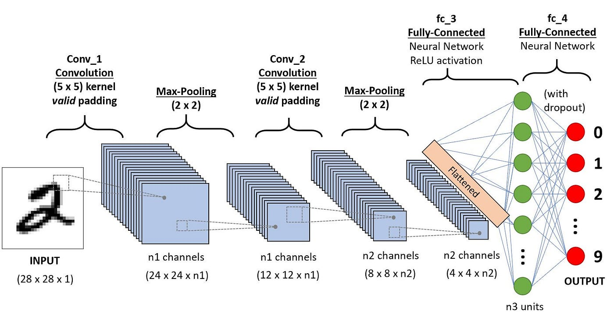

## 4.1 Kenapa Perlu CNN?
Bayangkan Anda memiliki data gambar berwarna dengan ukuran **1000x1000** piksel, di mana setiap piksel memiliki tiga komponen warna: **Merah (Red), Hijau (Green), dan Biru (Blue)**. Dengan tiga saluran warna ini, satu data gambar sebenarnya mencakup tiga data berbeda. Representasi input pada Neural Network (NN) tradisional memanfaatkan setiap komponen warna dari setiap piksel sebagai input, sehingga jumlah total input pada NN menjadi **3 x 1000 x 1000**. Sebagai contoh, dengan 1000 node pada hidden layer pertama, jumlah koneksi dari input layer ke hidden layer adalah sebanyak **3 x 1000 x 1000 x 1000**. Jumlah koneksi tersebut mencerminkan kompleksitas model dan jumlah bobot yang perlu diestimasi selama pelatihan. Pengelolaan dimensi dan kompleksitas menjadi kritis dalam merancang dan melatih model NN, khususnya ketika bekerja dengan gambar berukuran besar, dan teknik seperti subsampling atau pooling dapat membantu mengatasi tantangan tersebut. Dengan begitu maka akan terbentuk 3 miliar koneksi. 
Dengan jumlah tersebut maka beban komputasi akan sangat besar dan membutuhkan waktu yang sangat lama. Oleh karena itu CNN hadir untuk menyelesaikan permasalahan tersebut.

## 4.2 Definisi CNN
  
**Convolutional Neural Network (CNN)**, atau disingkat sebagai ConvNet, adalah jenis arsitektur jaringan saraf yang dirancang khusus untuk memproses data grid seperti gambar dan video. Keunggulan utama Convolutional Neural Network (CNN) terletak pada kemampuannya untuk mengelola kompleksitas data visual, khususnya dalam konteks gambar. Adapun arsitektur CNN sendiri terdiri dari
### 1. Convolutional Layer
Layer konvolusi (Convolutional Layer) dalam Convolutional Neural Network (CNN) adalah komponen kunci yang bertanggung jawab untuk mengekstrak fitur-fitur dari data visual, seperti gambar. Pada layer ini terdapat filter berupa matriks yang digunakan untuk mencari fitur pada gambar.

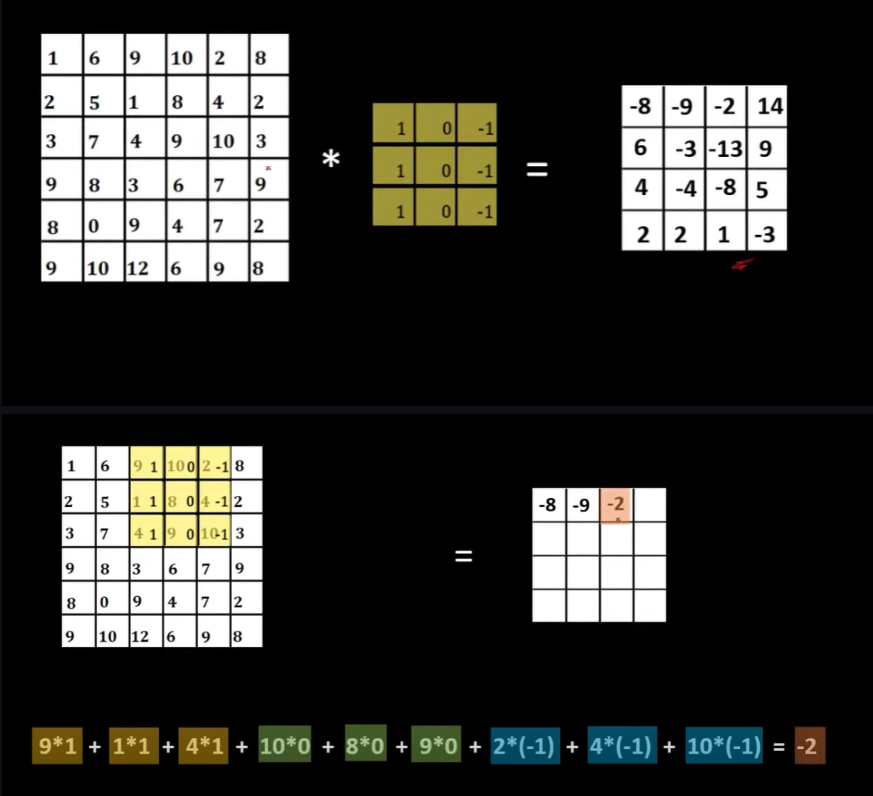


Dengan melakukan operasi di atas maka, layer konvolusi akan menghasilkan gambar baru berupa fitur yang didapatkan. Seperti contoh gambar di bawah ini:

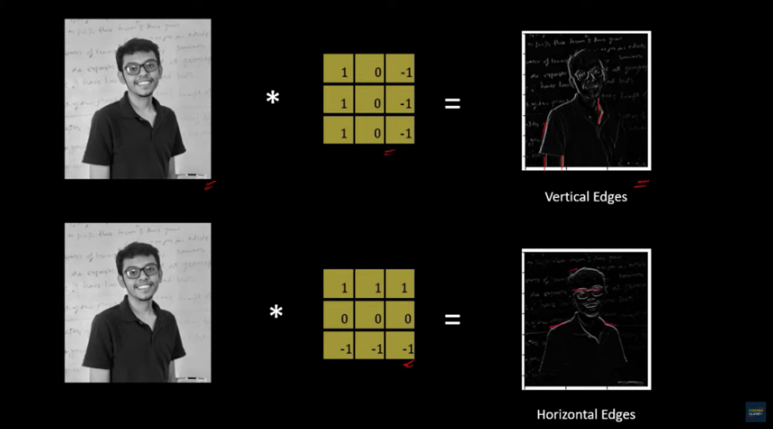

Pada gambar di atas dilakukan implementasi filter pencarian tepi vertikal dan horizonal. Melalui proses konvolusi maka jumlah piksel atau fitur yang akan diolah dapat dikurangi. Setiap filter nantinya akan bertanggungjawab pada pencarian sebuah fitur sehingga jumlah gambar fitur yang dihasilkan akan sesuai dengan jumlah filter yang digunakan.
Contoh di atas merupakan contoh pencarian fitur dengan gambar hitam putih sehingga layer yang dimiliki hanya satu. Namun, apabila layer dari gambar ada 3 seperti RGB maka setiap layer akan diterapkan filter yang sama sehingga akan ada 3 filter yang mengolahnya. Untuk contohnya adalah sebagai berikut:

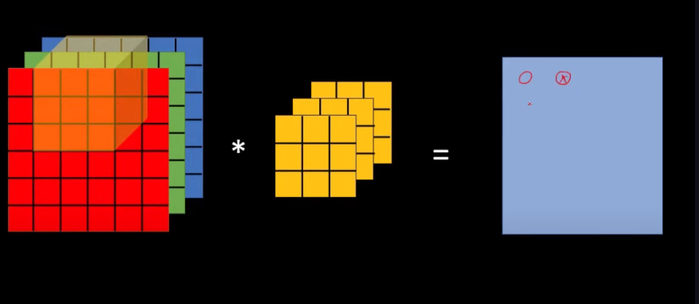

Melalui penerapan filter akan dihasilkan sebuah hasil ekstraksi fitur melalui operasi konvolusi yang dilakukan. Jumlah filter yang akan digunakan dalam sebuah layer konvolusi adalah parameter yang dapat diatur atau ditentukan pada saat perancangan arsitektur Convolutional Neural Network (CNN). Jumlah filter ini dapat bervariasi tergantung pada berbagai faktor, termasuk kompleksitas tugas yang ingin diselesaikan, kompleksitas data visual, dan kebijakan desain model. Namun setiap filter nantinya akan menghasilkan sebuah fitur.

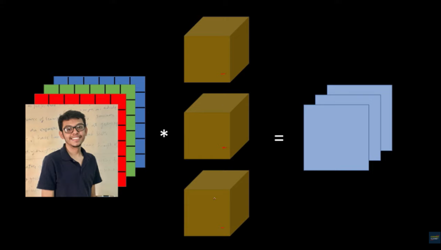

### 3. Padding
Padding secara deskriptif merupakan proses menambahkan piksel tambahan di sekitar gambar atau input data sebelum menjalankan operasi konvolusi pada Convolutional Neural Network (CNN). Tujuan utama dari penggunaan padding adalah untuk mempertahankan **informasi tepi dan struktur spasial** dari input data selama operasi konvolusi. Karena ketika kita menggunakan lebih dari satu layer konvolusi maka **proses reduksi dimensi akan dilakukan sejumlah layer** tersebut sehingga berpotensi untuk **kehilangan informasi penting.** Permasalahan kedua yaitu perhatikan gambar berikut:

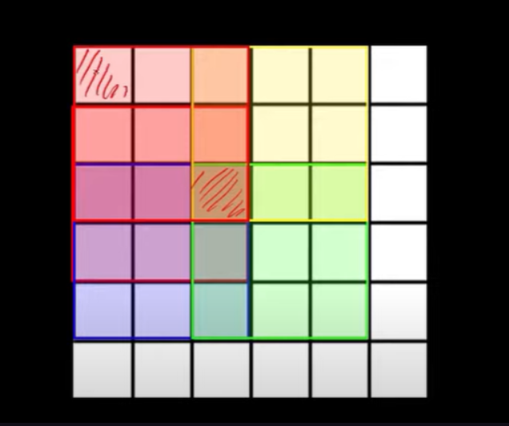

Pada gambar tersebut piksel pada sebelah pojok kiri akan kurang mendapatkan perhatian karena operasi konvolusi jarang dilakukan pada bagian tersebut. Selain itu pada piksel di tengah sebaliknya. Sehingga untuk mengatasi permasalahan tersebut maka dilakukan pemberian padding dengan menambahkan sejumlah piksel bernilai 0 seperti gambar di bawah ini:

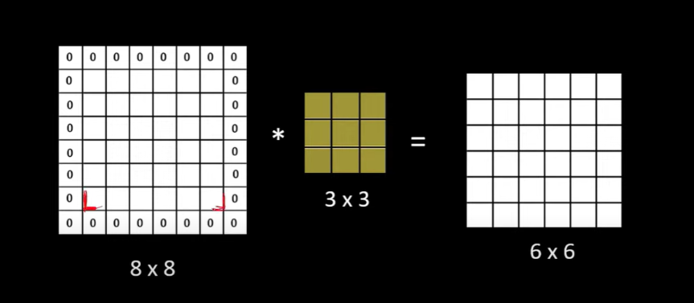

Dengan begitu reduksi fitur tidak terlalu signifikan sehingga informasi tepi dapat dipertahankan dan setiap piksel mendapatkan perhatian yang cukup. Terdapat beberapa jenis padding yaitu:
1. **Zero Padding:**
    - Menambahkan piksel dengan nilai nol di sekitar gambar.
    - Contoh: Jika gambar awalnya berukuran 3x3, setelah zero padding akan menjadi 5x5.
2. **Valid Padding:**
    - Tidak menambahkan piksel tambahan.
    - Ukuran gambar akan berkurang setelah operasi konvolusi.
    - Juga dikenal sebagai "no padding" atau "non-padding."
3. **Same Padding:**
    - Menambahkan piksel sehingga ukuran output sama dengan ukuran input.
    - Dengan kernel berukuran ganjil, piksel ditambahkan di sekitar gambar dengan jumlah yang sama pada setiap sisi.
### 4. Stride
Stride adalah parameter yang menentukan **langkah sejauh berapa filter atau kernel bergerak saat menjalankan operasi konvolusi** pada input data dalam Convolutional Neural Network (CNN). Stride mengontrol seberapa cepat filter berpindah melintasi input data dan mempengaruhi ukuran output dari operasi konvolusi.

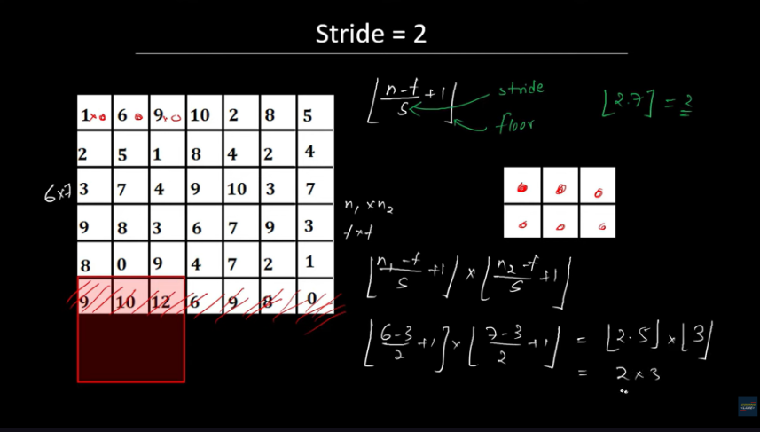

### Fungsi dan Pengaruh Stride:

1. **Mengontrol Dimensi Output:**
    - Stride memainkan peran penting dalam menentukan ukuran output setelah operasi konvolusi.
    - Dengan stride yang lebih besar, ukuran output cenderung lebih kecil, sementara stride yang lebih kecil menghasilkan output yang lebih besar.
2. **Pengurangan Dimensi:**
    - Stride yang lebih besar mengakibatkan pengurangan dimensi spatial (lebar atau tinggi) dari peta fitur output.
    - Hal ini dapat meningkatkan efisiensi komputasi karena jumlah langkah yang lebih besar mengurangi jumlah operasi konvolusi yang perlu dilakukan.
3. **Penting dalam Desain Arsitektur:**    
    - Stride dapat diatur secara independen untuk setiap dimensi (lebar dan tinggi) dari kernel.
    - Desain arsitektur CNN dapat menggabungkan stride yang berbeda di berbagai lapisan untuk mencapai representasi yang lebih kompleks dan efisien.
### 5. Max Pooling
**Max pooling** adalah operasi yang umumnya digunakan dalam Convolutional Neural Network (CNN) untuk **mereduksi dimensi spasial dari peta fitur (feature map) yang dihasilkan oleh layer konvolusi.** Operasi max pooling dilakukan dengan mengambil nilai maksimum dari sekelompok piksel tetangga di peta fitur. Ini membantu mengurangi jumlah parameter dan komputasi dalam model.

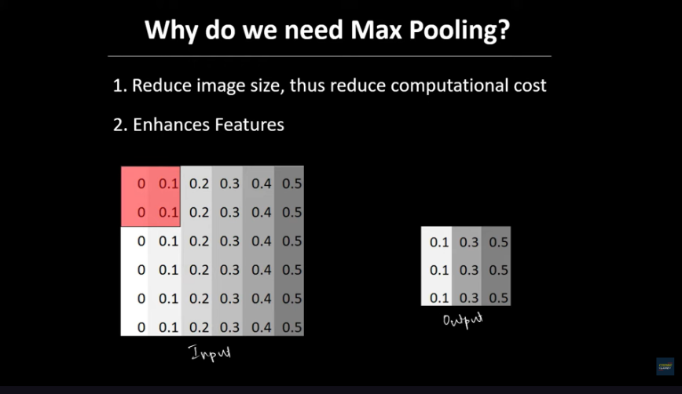

Dengan menggunakan cara di atas maka akan dihasilkan gambar dengan dimensi yang lebih rendah dengan fitur yang lebih kuat.

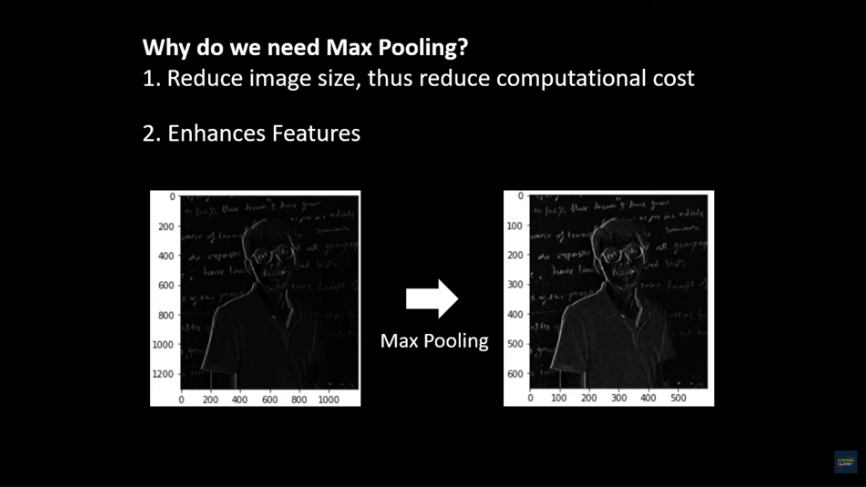

Gambar yang dihasilkan oleh max polling akan sesuai dengan hasil konvolusi yang dihasilkan. Selain mengambil nilai maksimal pada setiap section, terdapat tipe max polling yang mengambil nilai rata - rata dari setiap section seperti di bawah ini:

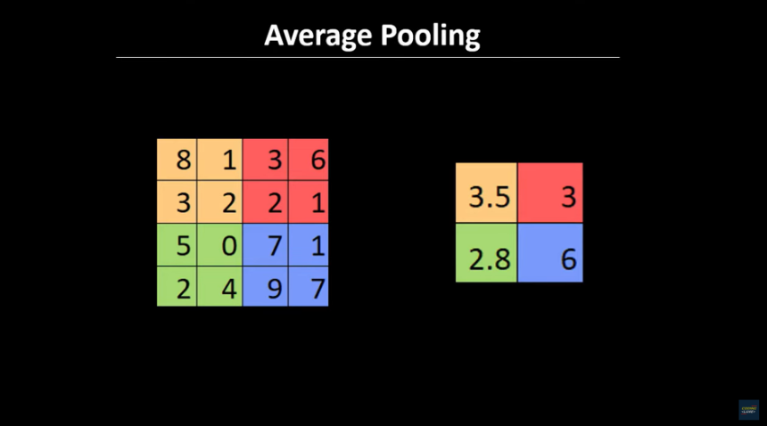

### 6. Fully Connected Layer
**Fully Connected Layer**, juga dikenal sebagai Dense Layer atau Fully Connected Neural Network (FCNN), adalah jenis layer yang terdapat pada akhir arsitektur Convolutional Neural Network (CNN) atau pada jaringan saraf tiruan (ANN) yang terdiri dari layer-layer konvolusi dan pooling. Fully Connected Layer bertanggung jawab untuk menghubungkan setiap neuron di layer sebelumnya ke setiap neuron di layer tersebut.

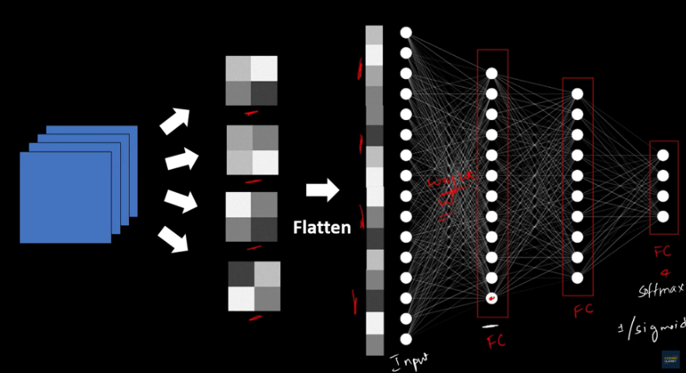

Sebelum masuk ke dalam fully connected layer, hasil dari max polling akan dilakukan flatten yang mana Operasi Flatten adalah proses transformasi yang mengubah data input dari bentuk matriks multidimensional menjadi bentuk **vektor satu dimensi.** Flatten sering digunakan sebelum mengarahkan data ke Fully Connected Layer pada arsitektur Convolutional Neural Network (CNN) atau sebelum mengonversi data ke input layer pada arsitektur Neural Network (NN) yang sepenuhnya terhubung.
### Karakteristik Fully Connected Layer:
1. **Hubungan Penuh (Full Connection):**
    - Setiap neuron di Fully Connected Layer terhubung dengan setiap neuron di layer sebelumnya. Ini menciptakan hubungan penuh atau sepenuhnya terhubung antara setiap input dan output.
2. **Bobot dan Bias:**
    - Setiap koneksi antara neuron di layer sebelumnya dengan neuron di Fully Connected Layer memiliki bobot yang sesuai. Ada juga parameter bias untuk setiap neuron di Fully Connected Layer.
### Fungsi Fully Connected Layer:
1. **Klasifikasi:**
    - Pada tugas klasifikasi, Fully Connected Layer digunakan untuk menghubungkan fitur-fitur yang telah diekstrak dari data input ke neuron-neuron output yang sesuai dengan kelas-kelas yang mungkin ada.
2. **Regresi:**
    - Pada tugas regresi, Fully Connected Layer dapat digunakan untuk menghubungkan fitur-fitur input ke neuron-neuron output yang menghasilkan nilai regresi.
3. **Representasi Global:**
    - Fully Connected Layer menciptakan representasi global yang menyatukan informasi dari berbagai bagian data input, sehingga memungkinkan model untuk membuat keputusan berdasarkan keseluruhan konteks.

# 5. Pytorch 

PyTorch adalah pustaka deep learning yang digunakan untuk membangun dan melatih model machine learning, khususnya jaringan saraf (neural networks).

## 5.1 Contoh Sederhana Regresi Linear: 
```python
import torch
import torch.nn as nn
import torch.optim as optim

# Data
X = torch.tensor([[1.0], [2.0], [3.0], [4.0]], requires_grad=False)
y = torch.tensor([[5.0], [7.0], [9.0], [11.0]], requires_grad=False)

# Model Linear: y = wx + b
class LinearRegressionModel(nn.Module):
    def __init__(self):
        super(LinearRegressionModel, self).__init__()
        self.linear = nn.Linear(1, 1)  # Input 1 feature, output 1 target

    def forward(self, x):
        return self.linear(x)

model = LinearRegressionModel()

# Mean Squared Error (MSE) Loss dan SGD Optimizer
criterion = nn.MSELoss()
optimizer = optim.SGD(model.parameters(), lr=0.01)

# Training Loop
epochs = 100
for epoch in range(epochs):
    # Forward Pass
    predictions = model(X)
    loss = criterion(predictions, y)

    # Backward Pass
    optimizer.zero_grad()  # Reset gradien
    loss.backward()        # Hitung gradien
    optimizer.step()       # Perbarui parameter

    if (epoch + 1) % 10 == 0:
        print(f'Epoch {epoch+1}/{epochs}, Loss: {loss.item()}')

# Lihat bobot dan bias hasil pelatihan
w, b = model.linear.weight.item(), model.linear.bias.item()
print(f"Hasil Model: y = {w:.2f}x + {b:.2f}")

```

## 5.2 Contoh Sederhana Klasifikasi:

```python
X = torch.tensor([[0, 0], [0, 1], [1, 0], [1, 1]], dtype=torch.float32)
y = torch.tensor([[0], [1], [1], [0]], dtype=torch.float32)

class XORModel(nn.Module):
    def __init__(self):
        super(XORModel, self).__init__()
        self.hidden = nn.Linear(2, 4)  # 2 input features, 4 neurons in hidden layer
        self.output = nn.Linear(4, 1)  # 4 hidden neurons, 1 output

    def forward(self, x):
        x = torch.sigmoid(self.hidden(x))  # Aktivasi sigmoid di hidden layer
        x = torch.sigmoid(self.output(x))  # Aktivasi sigmoid di output layer
        return x


model = XORModel()

criterion = nn.BCELoss()  # Binary Cross Entropy Loss
optimizer = optim.SGD(model.parameters(), lr=0.1)

epochs = 5000 # Model dilatih selama 5000 iterasi (epoch) untuk memastikan model mempelajari pola XOR dengan baik.
for epoch in range(epochs):
    # Forward pass
    predictions = model(X) # Input X dimasukkan ke dalam model, dan hasilnya adalah output prediksi (dalam rentang [0,1]).

    loss = criterion(predictions, y) # Loss dihitung dengan membandingkan prediksi dengan target y.

    # Backward pass
    optimizer.zero_grad() # Gradien yang dihitung sebelumnya direset agar tidak terakumulasi.
    loss.backward() # Gradien loss dihitung terhadap parameter model.
    optimizer.step() # Parameter model diperbarui menggunakan gradien yang telah dihitung.

    if (epoch + 1) % 500 == 0:
        print(f'Epoch {epoch+1}/{epochs}, Loss: {loss.item()}')
```

## 5.3 CNN untuk CIFAR-10

1. **Import Library**

```python
import torch
import torch.nn as nn
import torch.optim as optim
import torchvision
import torchvision.transforms as transforms
```

2. **Dataset dan Data Loader**

```python
# Transformasi dataset: Normalisasi gambar dan konversi ke tensor
transform = transforms.Compose([
    transforms.ToTensor(),  # Konversi gambar ke tensor
    transforms.Normalize((0.5, 0.5, 0.5), (0.5, 0.5, 0.5))  # Normalisasi (mean, std) per channel
])

# Download dan load dataset CIFAR-10
trainset = torchvision.datasets.CIFAR10(root='./data', train=True, download=True, transform=transform)
trainloader = torch.utils.data.DataLoader(trainset, batch_size=32, shuffle=True)

testset = torchvision.datasets.CIFAR10(root='./data', train=False, download=True, transform=transform)
testloader = torch.utils.data.DataLoader(testset, batch_size=32, shuffle=False)

# Daftar kelas di CIFAR-10
classes = ('plane', 'car', 'bird', 'cat', 'deer', 'dog', 'frog', 'horse', 'ship', 'truck')
```

3. **Definisi CNN**

```python
class CNNModel(nn.Module):
    def __init__(self):
        super(CNNModel, self).__init__()
        # Lapisan Convolutional 1: Input channel 3 (RGB), output channel 32
        self.conv1 = nn.Conv2d(3, 32, kernel_size=3, stride=1, padding=1)
        self.pool = nn.MaxPool2d(kernel_size=2, stride=2)  # Max Pooling layer
        # Lapisan Convolutional 2: Input channel 32, output channel 64
        self.conv2 = nn.Conv2d(32, 64, kernel_size=3, stride=1, padding=1)
        # Fully connected layer 1: Menghubungkan fitur ke neuron (64*8*8 ke 128)
        self.fc1 = nn.Linear(64 * 8 * 8, 128)
        # Fully connected layer 2: Output 10 neuron (untuk 10 kelas)
        self.fc2 = nn.Linear(128, 10)

    def forward(self, x):
        x = torch.relu(self.conv1(x))  # Aktivasi ReLU setelah konvolusi pertama
        x = self.pool(x)              # Max Pooling untuk mengurangi dimensi
        x = torch.relu(self.conv2(x)) # Aktivasi ReLU setelah konvolusi kedua
        x = self.pool(x)              # Max Pooling kedua
        x = x.view(-1, 64 * 8 * 8)    # Flatten data menjadi vektor 1D
        x = torch.relu(self.fc1(x))   # Aktivasi ReLU pada fully connected pertama
        x = self.fc2(x)               # Fully connected kedua (output tanpa aktivasi)
        return x
```

4. **Inisialisasi Model, Loss, dan Optimizer** : 

```python
model = CNNModel()  # Inisialisasi model
criterion = nn.CrossEntropyLoss()  # Loss untuk klasifikasi multi-kelas
optimizer = optim.Adam(model.parameters(), lr=0.001)  # Optimizer Adam
```

5. **Training Model** :

```python
for epoch in range(10):  # 10 epoch
    running_loss = 0.0
    for i, data in enumerate(trainloader, 0):
        inputs, labels = data  # Data input (gambar) dan label
        optimizer.zero_grad()  # Reset gradien
        outputs = model(inputs)  # Forward pass
        loss = criterion(outputs, labels)  # Hitung loss
        loss.backward()  # Backward pass (hitung gradien)
        optimizer.step()  # Perbarui parameter

        running_loss += loss.item()
        if i % 100 == 99:  # Cetak setiap 100 batch
            print(f'[Epoch {epoch + 1}, Batch {i + 1}] Loss: {running_loss / 100:.3f}')
            running_loss = 0.0
```

6. **Evaluasi Model** :

```python
correct = 0
total = 0
with torch.no_grad():  # Tidak menghitung gradien
    for data in testloader:
        images, labels = data
        outputs = model(images)
        _, predicted = torch.max(outputs, 1)  # Prediksi kelas dengan probabilitas tertinggi
        total += labels.size(0)  # Total jumlah data
        correct += (predicted == labels).sum().item()  # Hitung prediksi benar

print(f'Accuracy: {100 * correct / total:.2f}%')
```