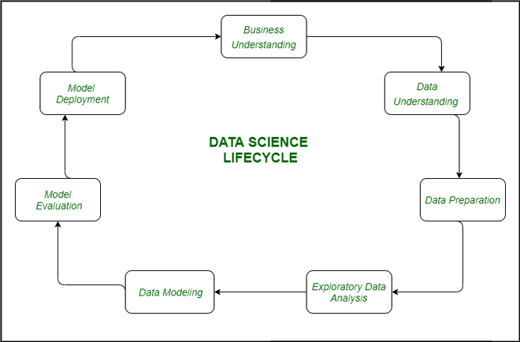
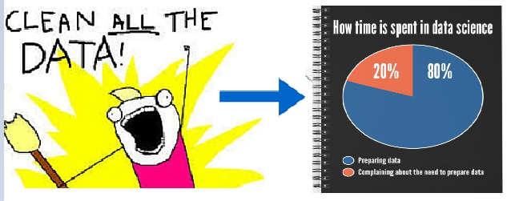
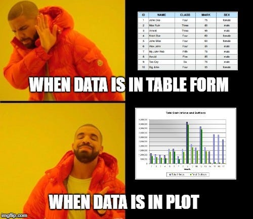
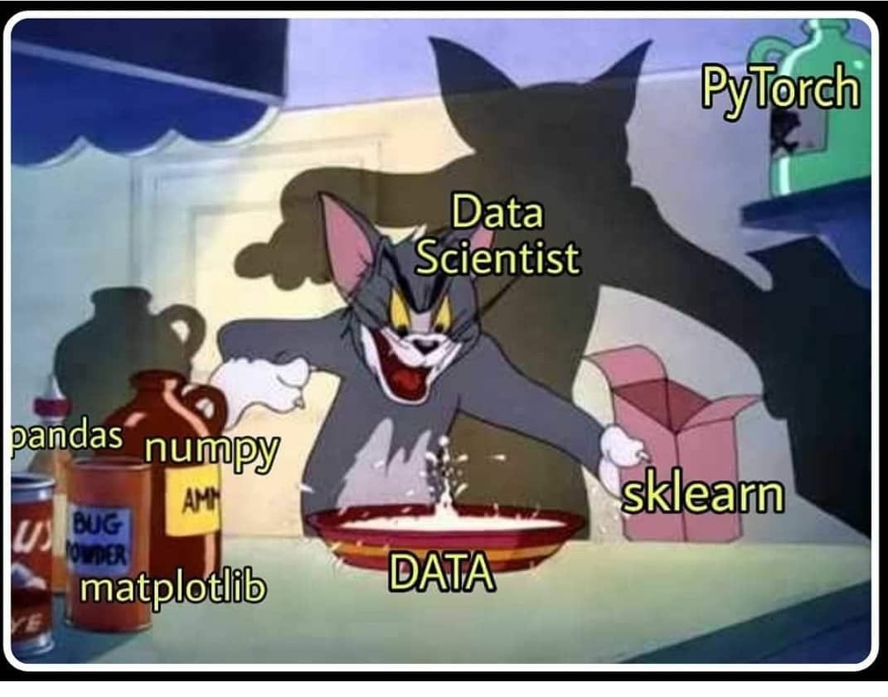

# **1. Data Science Life Cycle**

Tujuan utama dari sebuah proyek sains data adalah untuk menjawab permasalahan atau tujuan bisnis yang telah ditetapkan pada tahap awal. Untuk mencapai tujuan ini, proses dalam proyek sains data jarang bersifat linier dan selesai dalam satu siklus iterasi. Sebaliknya, pengembangan proyek sains data melibatkan pendekatan yang iteratif dan berulang, di mana setiap tahap memberikan wawasan yang dapat mengarah pada revisi atau penyempurnaan tahap sebelumnya.

Dalam pengembangan proyek sains data, terbentuk sebuah siklus yang terdiri dari beberapa tahapan terintegrasi yang saling berhubungan erat. Tahapan tersebut dimulai dari **pemahaman bisnis dan data**, diikuti dengan **pembersihan dan pemrosesan data**, kemudian **eksplorasi data** untuk menemukan pola dan anomali, hingga akhirnya memasuki **pembangunan model prediktif atau deskriptif** yang sesuai dengan tujuan bisnis. Setelah model dibuat, proses dilanjutkan dengan **evaluasi model**, dan berakhir pada **penerapan model (deployment)** ke dalam lingkungan produksi.

Siklus ini bersifat dinamis, karena pada setiap tahap dimungkinkan dilakukan penyesuaian berdasarkan hasil evaluasi di setiap langkah. Contohnya, jika pada tahap evaluasi model ditemukan bahwa kinerja model tidak optimal, data scientist dapat kembali ke tahap sebelumnya untuk menyesuaikan fitur data atau mencoba pendekatan algoritmik yang berbeda. Oleh karena itu, **Data Science Life Cycle** menciptakan pendekatan berulang (iteratif) yang memungkinkan pengembangan solusi yang lebih robust, akurat, dan relevan terhadap masalah yang dihadapi bisnis.

## 1. Pemahaman Masalah dan Tujuan Bisnis (Business Understanding)

Setiap proyek sains data dimulai dengan pemahaman yang mendalam tentang masalah bisnis yang ingin dipecahkan (Hambatan, tantangan, atau peluang yang dihadapi oleh sebuah organisasi atau perusahaan yang dapat berdampak negatif terhadap operasional, kinerja, atau pertumbuhan perusahaan jika tidak diatasi). Pada tahap ini, tujuan utama adalah mendefinisikan permasalahan secara jelas dan mengidentifikasi key performance indicators (KPI) atau metrik yang akan digunakan untuk mengevaluasi keberhasilan solusi data science.

Langkah-langkah:

1. Identifikasi masalah bisnis atau pertanyaan bisnis yang harus dijawab.
2. Definisikan tujuan proyek berdasarkan nilai yang akan ditambahkan ke bisnis.
3. Tentukan KPI dan metrik evaluasi yang akan digunakan untuk mengukur kesuksesan.

Hasil: Pernyataan masalah yang jelas dan tujuan bisnis yang diharapkan.

**STUDI KASUS :**
Sebuah toko buku lokal ingin meningkatkan penjualan mereka dengan memprediksi berapa banyak pengunjung yang akan datang pada hari-hari tertentu, sehingga mereka dapat mengatur stok dan promosi dengan lebih baik. Mereka memiliki data historis mengenai jumlah pengunjung setiap hari, data promosi yang dijalankan, serta informasi cuaca harian.

1. **Identifikasi Masalah Bisnis:**
   Toko buku sering mengalami kekurangan atau kelebihan stok, yang mengakibatkan kerugian pendapatan dan pemborosan sumber daya. Pemilik ingin mengetahui kapan lonjakan pengunjung terjadi agar dapat merencanakan pengisian stok dan promosi yang lebih baik.

2. **Tujuan Proyek:**
   Membangun model prediksi untuk memprediksi jumlah pengunjung harian berdasarkan faktor-faktor seperti hari dalam seminggu, adanya promosi, dan kondisi cuaca.

3. **Key Performance Indicators (KPIs):**
   - Akurasi prediksi jumlah pengunjung harian.
   - Pengurangan jumlah kelebihan atau kekurangan stok.
   - Peningkatan penjualan selama periode promosi.

## 2. Pemahaman Data (Data Understanding)

Setelah pemahaman bisnis, langkah selanjutnya adalah pemahaman data. Langkah ini melibatkan pengumpulan semua data yang tersedia. Dalam tahap ini, Anda perlu bekerja sama secara dekat dengan **tim bisnis**, karena mereka memiliki pengetahuan mendalam tentang data yang ada, jenis data yang dapat digunakan untuk menyelesaikan masalah bisnis, dan informasi lain yang relevan.
Langkah-langkah:

1. **Pengumpulan Data:**
   Pada tahap ini, tim mengidentifikasi dan mengumpulkan semua sumber data yang relevan yang diperlukan untuk analisis. Ini termasuk menentukan sumber data, jenis data yang akan digunakan, serta mengumpulkan data dari berbagai sumber, seperti database, API, atau file eksternal.

2. **Deskripsi Data:**
   Mendeskripsikan dataset yang ada. Ini mencakup informasi mengenai struktur data, tipe data, dan relevansi setiap fitur. Anda perlu mengidentifikasi kolom-kolom dalam dataset, seperti nama kolom, tipe data (numerik, kategorikal, teks, dll.), dan memberikan gambaran umum tentang apa yang diukur oleh masing-masing kolom. Hal ini akan membantu dalam memahami bagaimana data tersebut berkontribusi terhadap solusi masalah yang sedang dihadapi.

3. **Kualitas Data:**
   Selanjutnya, Anda perlu melakukan evaluasi kualitas data. Ini termasuk memeriksa adanya nilai yang hilang (missing values), duplikasi data, dan inkonsistensi dalam data. Memahami kualitas data sangat penting karena data yang buruk dapat menghasilkan model yang tidak akurat. Anda harus mengembangkan strategi untuk menangani data yang hilang, seperti imputasi, penghapusan, atau menggunakan teknik lain yang sesuai.

4. **Pemahaman Domain:**
   Penting untuk memahami konteks bisnis dan domain data yang sedang dianalisis. Kolaborasi dengan tim yang memiliki pemahaman mendalam tentang industri dan proses bisnis dapat memberikan wawasan berharga. Melalui pemahaman ini, Anda dapat mengidentifikasi variabel yang paling relevan untuk analisis dan memahami bagaimana faktor eksternal dapat mempengaruhi data yang ada.

5. **Feature Engineering:**
   Tahap ini melibatkan penciptaan fitur baru dari data yang ada untuk meningkatkan kemampuan model. Anda mungkin perlu melakukan transformasi data, seperti normalisasi atau encoding untuk data kategorikal, serta menghasilkan fitur baru berdasarkan pengetahuan domain yang telah didapat. Misalnya, jika Anda bekerja pada proyek yang berkaitan dengan penjualan, Anda dapat membuat fitur baru yang mengindikasikan hari dalam seminggu atau musim untuk menganalisis pengaruhnya terhadap penjualan.

6. **Dokumentasi:**
   Setelah menyelesaikan langkah-langkah di atas, penting untuk mendokumentasikan temuan dan analisis yang telah dilakukan. Buat laporan yang menjelaskan struktur dataset, analisis yang telah dilakukan, kualitas data, serta wawasan yang diperoleh. Dokumentasi ini akan menjadi acuan bagi tim dan pemangku kepentingan saat melanjutkan ke tahap berikutnya dalam siklus hidup proyek sains data.

Berikut adalah penjelasan yang lebih detail mengenai **Persiapan Data (Data Preparation)** dalam siklus hidup sains data, ditulis dalam bahasa Indonesia:

### 3. **Persiapan Data (Data Preparation)**

Tahap persiapan data adalah langkah krusial dalam siklus hidup sains data yang bertujuan untuk menyiapkan data agar siap untuk analisis dan pemodelan. Proses ini melibatkan berbagai langkah yang bertujuan untuk memastikan bahwa data berkualitas tinggi dan sesuai untuk digunakan dalam model analitik.

Berikut adalah rincian dari langkah-langkah yang terlibat dalam persiapan data:

1. **Pemilihan Data yang Relevan**

   - **Deskripsi:** Pada langkah ini, tim memilih dataset yang relevan dari kumpulan data yang tersedia. Penting untuk memastikan bahwa data yang dipilih benar-benar mencakup variabel yang berkaitan dengan masalah bisnis yang ingin diselesaikan.
   - **Contoh:** Dalam kasus toko buku, memilih dataset yang berisi informasi tentang jumlah pengunjung, penjualan, jenis buku, dan faktor-faktor yang mungkin mempengaruhi pengunjung seperti promosi dan cuaca.

2. **Integrasi Data**

   - **Deskripsi:** Jika data berasal dari berbagai sumber, tahap ini mencakup penggabungan dataset tersebut untuk membentuk satu set data yang komprehensif. Integrasi dapat dilakukan melalui proses penggabungan (merge) berdasarkan kunci yang sama.
   - **Contoh:** Menggabungkan dataset penjualan dengan dataset promosi untuk menganalisis pengaruh kampanye promosi terhadap jumlah pengunjung.

3. **Pembersihan Data**

   - **Deskripsi:** Membersihkan data melibatkan penghapusan atau perbaikan data yang tidak akurat, duplikat, atau tidak lengkap. Ini juga mencakup penanganan nilai yang hilang.
   - **Contoh:** Menghapus entri duplikat dan memutuskan apakah akan menghapus baris dengan nilai yang hilang atau mengisi (impute) nilai tersebut dengan nilai rata-rata atau median.

4. **Penanganan Nilai yang Hilang**

   - **Deskripsi:** Menyusun strategi untuk menangani nilai yang hilang dalam dataset, baik dengan menghapus baris yang mengandung nilai tersebut atau mengisi nilai yang hilang dengan teknik imputasi yang tepat.
   - **Contoh:** Jika ada 10% nilai yang hilang pada kolom `jumlah_pengunjung`, tim dapat memutuskan untuk mengisi nilai tersebut dengan rata-rata pengunjung harian.

5. **Identifikasi dan Penanganan Outlier**

   - **Deskripsi:** Menggunakan metode visualisasi seperti box plots untuk mendeteksi outlier dalam data. Outlier yang teridentifikasi kemudian harus ditangani sesuai dengan analisis dan kebijakan yang ditetapkan.
   - **Contoh:** Jika terdapat outlier ekstrem pada data penjualan, tim dapat memutuskan untuk menghapusnya atau melakukan transformasi data agar lebih terdistribusi.

6. **Pembuatan Fitur Baru**

   - **Deskripsi:** Menghasilkan fitur baru dari data yang sudah ada untuk meningkatkan model. Ini termasuk mengkombinasikan beberapa kolom atau menerapkan transformasi matematis.
   - **Contoh:** Membuat fitur `jumlah_promo_hari_ini` dari kolom promosi untuk melihat pengaruh promosi pada jumlah pengunjung.

7. **Format Data**

   - **Deskripsi:** Mengubah format data agar sesuai dengan struktur yang diinginkan oleh model. Ini termasuk mengubah tipe data (misalnya, dari string ke numerik) dan menghapus kolom yang tidak relevan.
   - **Contoh:** Menghapus kolom yang tidak diperlukan seperti `ID_transaksi` yang tidak akan memberikan informasi tambahan dalam analisis.

8. **Dokumentasi Proses**
   - **Deskripsi:** Selama proses persiapan data, penting untuk mendokumentasikan langkah-langkah yang diambil dan keputusan yang dibuat. Dokumentasi ini berfungsi sebagai referensi dan transparansi dalam proses analisis.
   - **Contoh:** Mencatat bahwa kolom `tanggal` diubah menjadi format datetime untuk analisis lebih lanjut.

### 4. **Analisis Data Eksploratif (Exploratory Data Analysis - EDA)**

**Analisis Data Eksploratif (EDA)** adalah langkah penting dalam siklus hidup sains data yang bertujuan untuk memahami karakteristik dan pola dalam dataset sebelum membangun model prediksi. Pada tahap ini, kita tidak hanya mengeksplorasi data secara visual, tetapi juga mencari hubungan antara variabel, mendeteksi pola, dan mengidentifikasi anomali yang mungkin ada dalam data. Berikut adalah beberapa elemen kunci dari EDA:

#### **1. Tujuan EDA**

- **Memahami Data**: EDA membantu kita mendapatkan pemahaman mendalam tentang data yang akan digunakan. Ini termasuk melihat distribusi data, nilai yang hilang, dan potensi outlier.
- **Identifikasi Pola**: Menggunakan teknik visualisasi untuk mengidentifikasi pola dan tren yang mungkin ada dalam data.
- **Mendukung Pemodelan**: EDA memberikan wawasan yang diperlukan untuk memilih model yang tepat dan fitur yang harus dimasukkan dalam model.

#### **2. Teknik dan Metode EDA**

- **Visualisasi Data**:
  - **Histogram**: Digunakan untuk memahami distribusi variabel tunggal. Ini menunjukkan frekuensi nilai dalam rentang tertentu.
  - **Box Plot**: Menyediakan informasi tentang median, kuartil, dan outlier dari data.
  - **Bar Graphs**: Berguna untuk membandingkan kategori dalam variabel kategorikal. Ini membantu mengidentifikasi frekuensi atau rata-rata dari setiap kategori.
- **Analisis Hubungan Antar Variabel**:

  - **Scatter Plot**: Memvisualisasikan hubungan antara dua variabel numerik. Setiap titik pada scatter plot mewakili satu observasi.
  - **Heat Maps**: Menampilkan matriks korelasi antara variabel dalam bentuk warna, sehingga kita dapat dengan cepat melihat hubungan yang kuat atau lemah di antara variabel.

- **Statistik Deskriptif**:
  - Menghitung ukuran statistik dasar seperti rata-rata, median, modus, varians, dan deviasi standar untuk memberikan ringkasan numerik dari data.
  - Memperoleh informasi mengenai nilai yang hilang dan distribusi dari setiap variabel.

#### **3. Proses EDA**

- **Pembersihan Data**: Sebelum melakukan eksplorasi, penting untuk memastikan data sudah bersih dari nilai yang hilang dan anomali.
- **Visualisasi Awal**: Menggunakan teknik visualisasi sederhana untuk mendapatkan gambaran umum tentang data.
- **Analisis Mendalam**: Menggunakan teknik visualisasi dan statistik deskriptif untuk mengeksplorasi hubungan antar variabel secara lebih mendalam.

#### **4. Contoh Penerapan EDA**

Mari kita ambil contoh studi kasus dari **toko buku** yang ingin menganalisis faktor-faktor yang mempengaruhi jumlah pengunjung:

1. **Pengumpulan Data**: Mengumpulkan data pengunjung, termasuk variabel seperti waktu kunjungan, kategori buku yang diminati, dan jumlah transaksi.

2. **Visualisasi Distribusi**:

   - Menggunakan **histogram** untuk menganalisis distribusi waktu kunjungan pengunjung. Ini membantu memahami kapan puncak pengunjung terjadi (misalnya, sore hari vs. pagi).

3. **Analisis Hubungan**:

   - Membuat **scatter plot** untuk mengeksplorasi hubungan antara kategori buku yang dibeli dan jumlah pengunjung. Dengan cara ini, kita dapat melihat apakah ada kategori buku tertentu yang lebih menarik bagi pengunjung.
   - Menggunakan **heat map** untuk menganalisis korelasi antara variabel, misalnya, antara kategori buku dan jumlah transaksi yang dilakukan. Ini membantu kita memahami kategori mana yang paling banyak menghasilkan penjualan.

4. **Statistik Deskriptif**:
   - Menghitung rata-rata dan median jumlah pengunjung harian serta transaksi untuk memberikan gambaran umum tentang performa toko buku.

### **5. Pemodelan Data (Data Modeling)**

Pemodelan data adalah langkah kunci dalam analisis data yang berfungsi sebagai jantung dari seluruh proses. Di tahap ini, data yang telah terorganisir digunakan sebagai input untuk membangun model yang akan menghasilkan output yang diinginkan. Berikut adalah penjelasan lebih detail mengenai proses pemodelan data.

#### **1. Tujuan Pemodelan Data**

- **Menghasilkan Output yang Diinginkan**: Model digunakan untuk menjawab pertanyaan bisnis atau memprediksi hasil berdasarkan data yang tersedia.
- **Membuat Keputusan Berbasis Data**: Dengan model yang akurat, organisasi dapat mengambil keputusan yang lebih baik dan berdasarkan bukti.

#### **2. Jenis Masalah dan Pemilihan Model**

Sebelum membangun model, penting untuk memahami jenis masalah yang dihadapi, yang dapat dikategorikan sebagai berikut:

- **Klasifikasi**: Masalah di mana tujuannya adalah untuk mengkategorikan data ke dalam kelas yang berbeda. Contoh: Memprediksi apakah seorang pengunjung akan membeli buku atau tidak.
- **Regresi**: Masalah di mana tujuannya adalah untuk memprediksi nilai kontinu. Contoh: Memprediksi jumlah pengunjung di toko buku berdasarkan data historis.
- **Klusterisasi**: Masalah di mana data dikelompokkan ke dalam kelompok yang memiliki kesamaan. Contoh: Mengelompokkan pengunjung berdasarkan kebiasaan belanja mereka.

#### **3. Pemilihan Algoritma**

Setelah menentukan jenis masalah, langkah selanjutnya adalah memilih model dari keluarga algoritma yang sesuai. Misalnya:

- Untuk klasifikasi, algoritma yang bisa dipilih termasuk:

  - **Logistic Regression**
  - **Decision Trees**
  - **Random Forest**
  - **Support Vector Machines (SVM)**
  - **Neural Networks**

- Untuk regresi, algoritma yang umum digunakan meliputi:
  - **Linear Regression**
  - **Polynomial Regression**
  - **Regression Trees**
- Untuk klusterisasi, algoritma seperti:
  - **K-Means**
  - **Hierarchical Clustering**
  - **DBSCAN** dapat digunakan.

#### **4. Tuning Hyperparameter**

- Setelah memilih algoritma, penting untuk menyetel **hyperparameter** untuk mendapatkan performa yang optimal. Hyperparameter adalah parameter yang ditetapkan sebelum pelatihan model dan dapat mempengaruhi hasil model secara signifikan. Contoh hyperparameter meliputi:

  - Jumlah pohon dalam Random Forest.
  - Jumlah kluster dalam K-Means.
  - Learning rate dalam algoritma optimasi.

- Proses tuning dapat dilakukan menggunakan teknik seperti **Grid Search** atau **Random Search**, di mana berbagai kombinasi hyperparameter diuji untuk menemukan yang paling sesuai.

#### **5. Menyeimbangkan Performa dan Generalisasi**

- Salah satu tantangan dalam pemodelan data adalah mencapai keseimbangan antara **performan** dan **generalisasi**. Performan mengacu pada seberapa baik model bekerja pada data pelatihan, sedangkan generalisasi merujuk pada kemampuan model untuk bekerja dengan baik pada data baru yang belum pernah dilihat sebelumnya.
- Untuk memastikan model tidak hanya belajar dari data pelatihan (overfitting), penting untuk menggunakan teknik validasi silang (cross-validation) dan memantau metrik performa pada dataset validasi.

### **6. Evaluasi Model (Model Evaluation)**

Evaluasi model merupakan tahap penting dalam siklus hidup sains data, di mana model yang telah dibangun diuji untuk memastikan bahwa ia siap untuk diterapkan dalam lingkungan produksi. Evaluasi ini dilakukan dengan menggunakan data yang tidak terlihat sebelumnya (unseen data) dan berdasarkan metrik penilaian yang telah ditentukan. Berikut adalah rincian lebih lanjut tentang proses evaluasi model:

#### **1. Tujuan Evaluasi Model**

- **Memastikan Kesiapan Model**: Tujuan utama dari evaluasi model adalah untuk menentukan apakah model siap untuk digunakan dalam situasi dunia nyata.
- **Menilai Kinerja Model**: Melalui evaluasi, kita dapat memahami seberapa baik model bekerja dalam membuat prediksi pada data yang tidak terlihat.

#### **2. Pengujian dengan Data yang Tidak Terlihat**

- Model dievaluasi menggunakan dataset yang tidak digunakan dalam proses pelatihan. Hal ini penting untuk mengukur kemampuan model dalam generalisasi, yaitu kemampuannya untuk memberikan prediksi yang baik pada data baru.

#### **3. Metrik Evaluasi**

- Metrik evaluasi adalah indikator yang digunakan untuk menilai kinerja model. Beberapa metrik umum yang digunakan adalah:
  - **Akurasi**: Proporsi prediksi yang benar terhadap total prediksi.
  - **Precision**: Proporsi prediksi positif yang benar terhadap seluruh prediksi positif.
  - **Recall (Sensitivitas)**: Proporsi prediksi positif yang benar terhadap seluruh data positif.
  - **F1 Score**: Harmonik rata-rata antara precision dan recall, memberikan gambaran yang lebih jelas ketika ada ketidakseimbangan kelas.
  - **Mean Absolute Error (MAE)** dan **Mean Squared Error (MSE)**: Digunakan dalam masalah regresi untuk mengukur kesalahan antara nilai prediksi dan nilai aktual.

#### **4. Konformitas terhadap Realitas**

- Selain mengevaluasi kinerja, penting untuk memastikan bahwa model mencerminkan realitas. Ini termasuk memastikan bahwa model tidak hanya memberikan hasil yang baik pada metrik evaluasi tetapi juga dapat diandalkan dalam situasi dunia nyata.

#### **5. Proses Iteratif**

- Jika hasil evaluasi tidak memenuhi standar yang diharapkan, proses pemodelan harus diulang. Ini mungkin melibatkan:
  - Memperbaiki data yang digunakan.
  - Menyesuaikan algoritma atau model yang digunakan.
  - Melakukan tuning hyperparameter lebih lanjut.
- Proses ini bersifat iteratif dan mungkin memerlukan beberapa kali evaluasi sebelum mencapai model yang optimal.

#### **6. Evolusi Model**

- Model yang baik harus mampu beradaptasi dan berkembang seiring dengan waktu dan perubahan data. Seiring dengan pengumpulan data baru, model harus dapat memperbaiki kinerjanya dengan melakukan retraining menggunakan data yang lebih baru.
- Selain itu, model harus mampu beradaptasi dengan metrik evaluasi baru yang mungkin relevan di masa depan.

#### **7. Memilih Model Terbaik**

- Dalam banyak kasus, kita mungkin mengembangkan beberapa model untuk fenomena tertentu. Proses evaluasi membantu dalam memilih model terbaik berdasarkan kinerja yang diukur dan kesesuaian terhadap kebutuhan bisnis.

### **7. Penerapan Model (Model Deployment)**

Setelah model melalui proses evaluasi yang ketat dan dianggap siap, tahap terakhir dalam siklus hidup sains data adalah penerapan model. Penerapan ini adalah langkah krusial yang menandai transisi dari fase pengembangan ke fase implementasi, di mana model mulai memberikan nilai tambah di lingkungan produksi. Berikut adalah rincian lebih lanjut mengenai proses penerapan model:

#### **1. Tujuan Penerapan Model**

- **Mengintegrasikan Model ke dalam Sistem**: Tujuan utama dari penerapan model adalah untuk mengintegrasikan model ke dalam sistem yang sudah ada, sehingga dapat mulai digunakan untuk membuat prediksi dan memberikan insight bisnis secara real-time.
- **Menawarkan Solusi yang Berguna**: Dengan menerapkan model, organisasi dapat memanfaatkan hasil analisis data untuk pengambilan keputusan yang lebih baik, meningkatkan efisiensi operasional, dan mendapatkan keuntungan kompetitif.

#### **2. Memilih Struktur dan Saluran Penerapan**

- Model dapat diterapkan dalam berbagai format dan saluran, tergantung pada kebutuhan bisnis dan infrastruktur yang ada. Beberapa opsi penerapan termasuk:
  - **Aplikasi Web**: Mengintegrasikan model ke dalam aplikasi berbasis web yang dapat diakses oleh pengguna.
  - **API (Application Programming Interface)**: Menyediakan model sebagai layanan melalui API, memungkinkan sistem lain untuk mengakses dan menggunakan model untuk prediksi.
  - **Aplikasi Mobile**: Mengimplementasikan model dalam aplikasi mobile untuk memberikan pengalaman pengguna yang lebih baik.

#### **3. Monitoring dan Pemeliharaan**

- Setelah model diterapkan, penting untuk memantau kinerjanya secara terus-menerus. Monitoring ini bertujuan untuk memastikan bahwa model tetap berkinerja baik di dunia nyata dan mampu memberikan hasil yang akurat.
- Jika terjadi penurunan kinerja, langkah-langkah pemeliharaan harus dilakukan, seperti:
  - Melakukan retraining model dengan data baru.
  - Menyesuaikan model jika terdapat perubahan dalam pola data atau kebutuhan bisnis.

#### **4. Pentingnya Setiap Langkah dalam Siklus Hidup Data Science**

- Setiap tahap dalam siklus hidup sains data, dari pemahaman bisnis hingga penerapan model, harus dilakukan dengan cermat. Kesalahan dalam satu langkah dapat mempengaruhi langkah-langkah berikutnya, yang pada akhirnya dapat merugikan seluruh usaha. Contoh:
  - **Pengumpulan Data**: Jika data tidak dikumpulkan dengan baik, hal ini dapat menyebabkan hilangnya informasi penting, yang mengakibatkan model yang tidak optimal.
  - **Pembersihan Data**: Data yang tidak dibersihkan dengan benar dapat menghasilkan model yang tidak akurat.
  - **Evaluasi Model**: Jika model tidak dievaluasi dengan baik, model tersebut mungkin gagal di dunia nyata, sehingga investasi yang dilakukan menjadi sia-sia.
