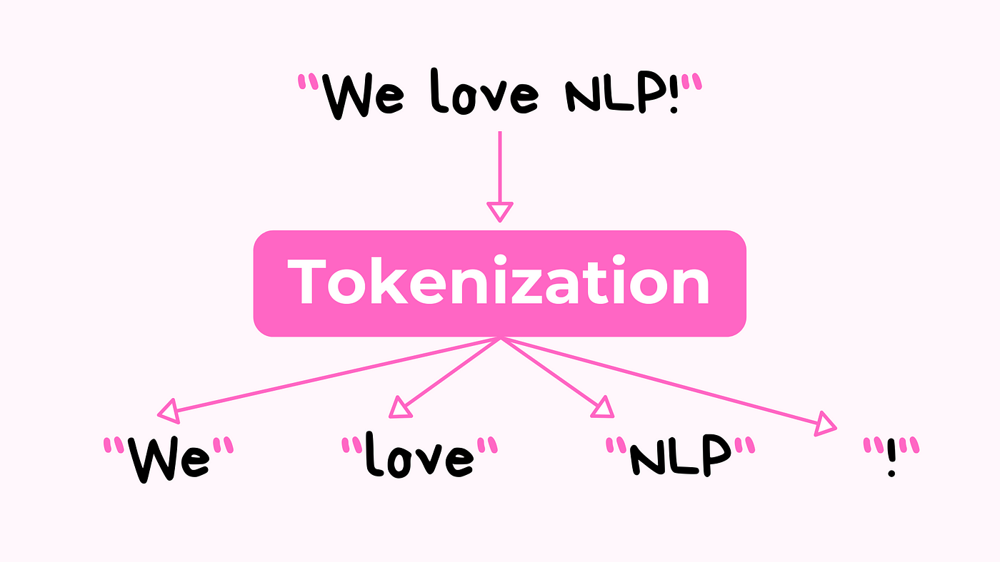
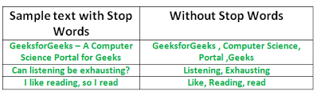
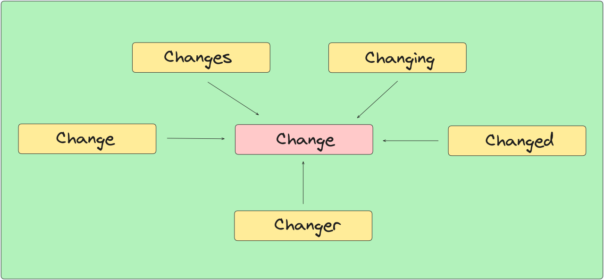
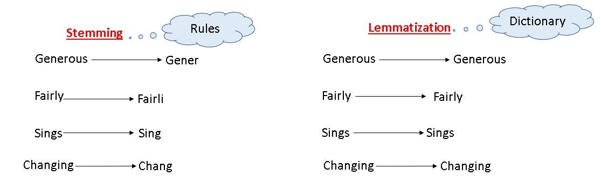
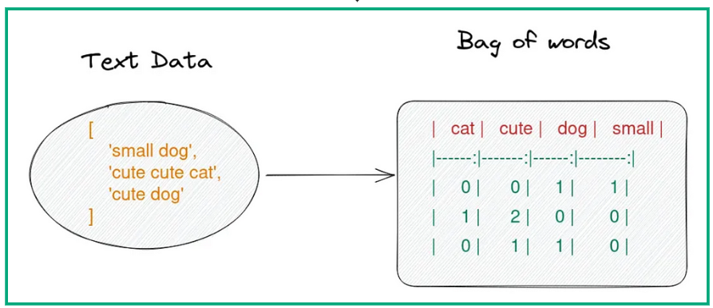

### Materi Natural Language Processing (NLP) untuk Pemula

Natural Language Processing (NLP) adalah bidang teknologi yang memungkinkan komputer memahami, menganalisis, dan merespons bahasa manusia. Jika Anda baru belajar tentang NLP, materi berikut dirancang agar mudah dipahami dan mencakup dasar-dasar yang perlu diketahui.

### 1. **Apa itu NLP?**

NLP adalah bagian dari kecerdasan buatan (AI) yang berfokus pada:
- **Pemahaman Bahasa Manusia**: Memahami makna kata, kalimat, atau paragraf.
- **Analisis Teks**: Menganalisis struktur bahasa.
- **Interaksi**: Membantu komputer merespons dalam bentuk bahasa yang dapat dimengerti manusia.

Contoh aplikasi NLP:
- Penerjemah Bahasa (Google Translate)
- Chatbot (misalnya, Siri atau Google Assistant)
- Analisis Sentimen (menentukan apakah opini positif atau negatif)

### 2. **Proses Dasar NLP**

#### a) **Tokenisasi**



Tokenisasi adalah proses memecah teks menjadi unit-unit kecil, seperti kata atau kalimat.  
Contoh:
- Input: "Saya suka belajar NLP."
- Output (Word Tokenization): ["Saya", "suka", "belajar", "NLP"]
- Output (Sentence Tokenization): ["Saya suka belajar NLP."]

#### b) **Stop Words**



Stop words adalah kata-kata umum yang sering diabaikan dalam analisis teks, seperti "dan", "di", "ke", "dari".  
Mengapa diabaikan? Karena kata-kata ini tidak memberikan banyak informasi penting.

#### c) **Stemming**



Stemming adalah proses mengubah kata ke bentuk dasarnya.  
Contoh:
- Input: "berlari", "lari", "berlarian"
- Output: "lari"

#### d) **Lematisasi**



Mirip dengan stemming, tetapi lebih memperhatikan makna kata dalam konteksnya.  
Contoh:
- "better" menjadi "good"
- "running" menjadi "run"

#### e) **Part-of-Speech Tagging (POS Tagging)**
POS tagging adalah proses mengidentifikasi jenis kata dalam kalimat, seperti kata benda (noun), kata kerja (verb), dll.  
Contoh:
- Input: "Saya makan nasi."
- Output: [("Saya", pronoun), ("makan", verb), ("nasi", noun)]

### 3. **Langkah-Langkah Mengerjakan Proyek NLP**

1. **Kumpulkan Data**  
   Contoh: Mengumpulkan ulasan produk dari situs web.

2. **Pra-pemrosesan Data**  
   - Bersihkan data: hapus simbol atau karakter tidak perlu.
   - Tokenisasi: pecah teks menjadi kata-kata.
   - Stop word removal: hilangkan kata-kata seperti "di", "dan", "ke".
   - Stemming atau lemmatisasi: sederhanakan kata ke bentuk dasar.

3. **Representasikan Teks ke Bentuk Angka**  
   Karena komputer tidak memahami teks, kita perlu mengubah teks menjadi angka.  
   Contoh:
   
    

   - **Bag of Words (BoW)**: Menghitung frekuensi setiap kata.

5. **Bangun Model NLP**  
   Gunakan algoritma pembelajaran mesin untuk menganalisis atau memprediksi sesuatu dari teks.  
   Contoh: Analisis sentimen menggunakan algoritma seperti Naive Bayes atau Logistic Regression.

6. **Evaluasi Model**  
   Ukur seberapa baik model bekerja dengan menggunakan metrik seperti akurasi, presisi, atau recall.

### 4. **Praktik Dasar dengan Python**

Python adalah bahasa pemrograman yang sering digunakan untuk NLP karena memiliki banyak pustaka (libraries) yang mempermudah tugas NLP.

#### a) **Pustaka Penting untuk NLP**
- **NLTK (Natural Language Toolkit)**: Untuk pemrosesan dasar seperti tokenisasi, stemming, dan POS tagging.
- **spaCy**: Untuk tugas NLP yang cepat dan efisien.
- **Scikit-learn**: Untuk membangun model pembelajaran mesin.
- **Hugging Face Transformers**: Untuk model canggih seperti BERT atau GPT.

#### b) **Contoh Kode Python Sederhana**

1. **Tokenisasi**
```python
from nltk.tokenize import word_tokenize

# Teks contoh
teks = "Saya belajar NLP hari ini."
# Tokenisasi kata
tokens = word_tokenize(teks)
print(tokens)
```

2. **Stemming**
```python
from nltk.stem import PorterStemmer

stemmer = PorterStemmer()
kata = ["running", "runner", "ran"]
hasil = [stemmer.stem(k) for k in kata]
print(hasil)
```

3. **Analisis Sentimen Sederhana**
```python
from textblob import TextBlob

# Teks contoh
teks = "Saya sangat bahagia hari ini!"
blob = TextBlob(teks)
print(blob.sentiment)
```

### 5. **Aplikasi Sederhana NLP untuk Pemula**

#### 1. **Analisis Sentimen**
Menganalisis apakah teks seperti ulasan atau komentar positif, negatif, atau netral.

#### 2. **Chatbot Dasar**
Membangun chatbot sederhana untuk menjawab pertanyaan umum.

#### 3. **Penerjemah Mini**
Menggunakan pustaka seperti Google Translator API untuk menerjemahkan teks.

## Klasifikasi Stentiment
```python
# Import pustaka yang diperlukan
import pandas as pd
from sklearn.model_selection import train_test_split
from sklearn.feature_extraction.text import CountVectorizer
from sklearn.naive_bayes import MultinomialNB
from sklearn.metrics import accuracy_score, classification_report

# Langkah 1: Memuat Data CSV
# Gantilah 'data.csv' dengan path file CSV Anda
df = pd.read_csv('data.csv')

# Tampilkan beberapa data untuk memastikan format CSV benar
print(df.head())

# Langkah 2: Memisahkan fitur dan label
X = df['text']  # Fitur (teks)
y = df['label']  # Label (kategori)

# Langkah 3: Membagi data menjadi data latih dan data uji (80% latih, 20% uji)
X_train, X_test, y_train, y_test = train_test_split(X, y, test_size=0.2, random_state=42)

# Langkah 4: Menggunakan CountVectorizer untuk mengubah teks menjadi representasi numerik (Bag of Words)
vectorizer = CountVectorizer(stop_words='english')  # stop_words='english' untuk menghapus stopwords
X_train_vec = vectorizer.fit_transform(X_train)  # Melakukan fit dan transformasi pada data latih
X_test_vec = vectorizer.transform(X_test)  # Menggunakan transformasi yang sama untuk data uji

# Langkah 5: Membuat dan melatih model Naive Bayes
model = MultinomialNB()
model.fit(X_train_vec, y_train)

# Langkah 6: Melakukan prediksi pada data uji
y_pred = model.predict(X_test_vec)

# Langkah 7: Evaluasi model
print(f'Akurasi Model: {accuracy_score(y_test, y_pred)}')
print(f'Laporan Klasifikasi:\n{classification_report(y_test, y_pred)}')
```
