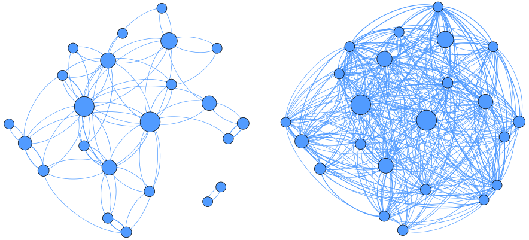
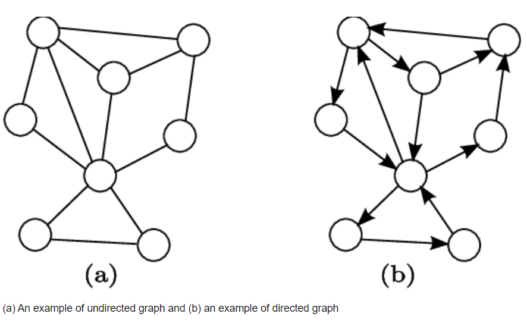

# Social Network Analysis



## 1. Definisi Social Network Analysis

Metode untuk memahami hubungan dan interaksi antara individu, kelompok, atau entitas lainnya dalam suatu jaringan sosial. Di dalam analisis ini, jaringan sosial dipandang dan direpresentasikan sebagai suatu struktur yang terdiri dari `simpul (nodes)` yang mewakili `entitas` dan `sisi (edges)` yang mewakili hubungan atau interaksi antar entitas.

Melalui SNA dapat diidentifikasi pola komunikasi dan peran masing-masing entitas dalam jaringan dan bagaimana struktur sosial tersebut dapat mempengaruhi keputusan individu dalam suatu jaringan.

## Contoh Kasus : Analisis Jaringan Sosial di Media

Sebuah perusahaan ingin memahami bagaimana kampanye pemasaran mereka tersebar melalui platform media sosial (misalnya, Twitter atau Instagram). Mereka ingin mengetahui siapa yang paling berpengaruh dalam percakapan mengenai produk mereka dan bagaimana informasi menyebar. Dalam hal ini setiap pengguna media sosial yang berbicara tentang produk perusahaan dianggap sebagai simpul. Hubungan antara pengguna tercipta melalui retweet, mention, atau tag yang berkaitan dengan kampanye pemasaran.

## 2. Representasi Jaringan



Jaringan dalam SNA digambarkan melalui graf yang terdiri dari dua komponen utama yaitu:

1. Simpul (Nodes): Mewakili aktor atau entitas dalam jaringan. Dalam jaringan sosial, simpul ini bisa berupa individu, kelompok, organisasi, atau bahkan hal-hal seperti pesan, konsep, atau lokasi.

2. Sisi (Edges): Mewakili hubungan atau interaksi antara dua simpul. Sisi ini bisa bersifat arah (directed) atau tak arah (undirected).
   - Arah: Hubungan satu arah, misalnya dalam hubungan pertemanan di media sosial (seperti Twitter), di mana satu orang mengikuti orang lain tetapi tidak sebaliknya.
   - Tak Arah: Hubungan dua arah, misalnya dalam hubungan pertemanan di Facebook, di mana kedua individu saling terhubung.

### Contoh Membuat Graf pada Python

**1. Membuat Graf**

```python
import networkx as nx
import matplotlib.pyplot as plt

# Membuat graf kosong
G = nx.Graph()

# Menambahkan simpul (nodes)
G.add_nodes_from(["A", "B", "C", "D"])

# Menambahkan sisi (edges)
G.add_edges_from([("A", "B"), ("A", "C"), ("B", "C"), ("C", "D")])

# Menggambar graf
plt.figure(figsize=(8, 6))
nx.draw(G, with_labels=True, node_color='lightblue', node_size=1000, font_size=15, font_weight='bold')
plt.title("Contoh Graf Sederhana", fontsize=16)
plt.show()
```

**2. Membuat Graf Dua Arah**

```python
import networkx as nx
import matplotlib.pyplot as plt

# Membuat graf berarah
DG = nx.DiGraph()

# Menambahkan simpul dan sisi berarah
DG.add_edges_from([("A", "B"), ("A", "C"), ("B", "D"), ("C", "D"), ("D", "A")])

# Menggambar graf
plt.figure(figsize=(8, 6))
nx.draw(DG, with_labels=True, node_color='lightgreen', node_size=1000, font_size=15, font_weight='bold', arrowsize=20)
plt.title("Contoh Graf Berarah", fontsize=16)
plt.show()
```

**3. Membuat Graf dengan Bobot**

```python
import networkx as nx
import matplotlib.pyplot as plt

# Membuat graf berarah dengan bobot
WG = nx.DiGraph()

# Menambahkan simpul dan sisi dengan bobot
WG.add_edge("A", "B", weight=5)
WG.add_edge("A", "C", weight=3)
WG.add_edge("B", "C", weight=2)
WG.add_edge("C", "D", weight=4)
WG.add_edge("D", "A", weight=1)

# Menggambar graf
pos = nx.spring_layout(WG)  # Layout untuk graf
plt.figure(figsize=(8, 6))

# Menggambar graf dengan bobot
nx.draw(WG, pos, with_labels=True, node_color='orange', node_size=1000, font_size=15, font_weight='bold', arrowsize=20)
labels = nx.get_edge_attributes(WG, 'weight')  # Mengambil atribut bobot
nx.draw_networkx_edge_labels(WG, pos, edge_labels=labels)

plt.title("Contoh Graf Berarah dengan Bobot", fontsize=16)
plt.show()
```

# 3. Ukuran Dasar dalam Social Network Analysis (SNA)

Dalam analisis jaringan sosial (Social Network Analysis - SNA), memahami struktur dan dinamika jaringan dilakukan dengan menghitung berbagai ukuran dasar. Ukuran ini membantu menjelaskan peran individu (node) dalam jaringan, serta karakteristik global jaringan secara keseluruhan. Materi ini dibagi menjadi dua bagian utama: Ukuran Node dan Ukuran Global.

## **Centrality Metrics (Ukuran Node)**

- **Degree Centrality** : Degree centrality mengukur jumlah koneksi langsung yang dimiliki oleh sebuah simpul (node). Dalam jaringan tak berarah, ini dihitung sebagai jumlah sisi (edges) yang terhubung ke simpul tersebut. Dalam jaringan berarah, dihitung sebagai `in-degree` atau jumlah koneksi masuk dan `out-degree` atau jumlah koneksi keluar. Nilai ini dapat diartikan bahwa Node dengan degree tinggi dianggap lebih terhubung atau lebih populer dalam jaringan.

Dalam konteks retweet di Twitter, **Degree Centrality** dapat digunakan untuk mengukur seberapa populer atau terhubungnya sebuah akun Twitter berdasarkan interaksi retweet yang diterimanya. Berikut adalah contoh kasus yang menggambarkan penggunaan degree centrality dalam analisis retweet Twitter:

### Kasus: Analisis Degree Centrality pada Retweet di Twitter

Misalkan ada beberapa akun Twitter yang terlibat dalam percakapan tentang topik tertentu, dan kita ingin menganalisis seberapa terhubung setiap akun dalam percakapan tersebut berdasarkan retweet.

1. **Akun-Akun yang Terlibat**:
   - Ada 5 akun Twitter: A, B, C, D, E.
2. **Interaksi Retweet**:

   - Akun **A** memposting tweet dan mendapatkan retweet dari akun **B** dan **C**.
   - Akun **B** memposting tweet dan mendapatkan retweet dari akun **A**, **C**, dan **D**.
   - Akun **C** memposting tweet dan mendapatkan retweet dari akun **A** dan **E**.
   - Akun **D** memposting tweet dan mendapatkan retweet dari akun **B** dan **E**.
   - Akun **E** memposting tweet dan mendapatkan retweet dari akun **C** dan **D**.

3. **Perhitungan Degree Centrality**:

   - **Degree centrality** untuk setiap akun dihitung dengan menjumlahkan jumlah retweet yang diterima dan yang dikirim:
     - **A**: Retweet yang diterima dari B dan C → Degree Centrality = 2.
     - **B**: Retweet yang diterima dari A, C, dan D → Degree Centrality = 3.
     - **C**: Retweet yang diterima dari A dan E → Degree Centrality = 2.
     - **D**: Retweet yang diterima dari B dan E → Degree Centrality = 2.
     - **E**: Retweet yang diterima dari C dan D → Degree Centrality = 2.

4. **Interpretasi Degree Centrality**:
   - **Akun B** memiliki degree centrality tertinggi (3), yang berarti akun ini lebih terhubung atau lebih populer dalam percakapan ini dibandingkan akun lainnya. Akun B mendapatkan lebih banyak retweet dari akun lain.
   - **Akun A, C, D, dan E** memiliki degree centrality yang sama (2), yang berarti mereka memiliki jumlah koneksi yang lebih sedikit dalam percakapan ini dibandingkan akun B.

- **Closeness Centrality** : Closeness centrality mengukur seberapa cepat sebuah node dapat mencapai node lain dalam jaringan. Semakin rendah jarak rata-rata dari sebuah node ke node lainnya, semakin tinggi closeness centrality-nya. Node dengan closeness centrality tinggi berada di posisi strategis untuk menyebarkan informasi dengan cepat ke seluruh jaringan.

Dalam konteks retweet Twitter, **Closeness Centrality** mengukur seberapa cepat sebuah akun dapat menyebarkan informasi ke akun lain di dalam jaringan retweet. Berikut adalah contoh penerapannya:

### Kasus: Analisis Closeness Centrality pada Retweet di Twitter

1. **Akun-Akun yang Terlibat**:

   - Ada 5 akun Twitter: A, B, C, D, E.

2. **Interaksi Retweet**:

   - **Akun A** mengirim tweet dan diretweet oleh **B** dan **C**.
   - **Akun B** mengirim tweet dan diretweet oleh **A** dan **D**.
   - **Akun C** mengirim tweet dan diretweet oleh **A** dan **E**.
   - **Akun D** mengirim tweet dan diretweet oleh **B** dan **E**.
   - **Akun E** mengirim tweet dan diretweet oleh **C** dan **D**.

3. **Perhitungan Closeness Centrality**:

   - **Closeness centrality** dihitung berdasarkan jarak rata-rata dari setiap akun ke akun lainnya, yaitu seberapa cepat akun tersebut dapat menjangkau akun lain. Semakin rendah rata-rata jarak, semakin tinggi closeness centrality-nya.

4. **Interpretasi Closeness Centrality**:
   - **Akun A** memiliki jarak yang lebih pendek ke banyak akun lain (misalnya A dapat langsung berhubungan dengan B dan C), sehingga memiliki closeness centrality yang tinggi, menunjukkan bahwa A berada di posisi strategis untuk menyebarkan informasi ke akun lain dalam jaringan.
   - **Akun B, C, D, dan E** memiliki jarak yang lebih panjang antar satu sama lain, sehingga mereka memiliki closeness centrality yang lebih rendah dibandingkan dengan A.

Closeness centrality memberikan gambaran tentang seberapa cepat suatu akun dapat menghubungkan dan menyebarkan informasi kepada akun-akun lain di dalam jaringan retweet Twitter.

- **Betweenness Centrality** : Betweenness centrality mengukur seberapa sering sebuah node menjadi perantara (penghubung) dalam jalur terpendek antara dua node lain. Hal ini dapat diartikan bahwa Node dengan betweenness tinggi adalah "broker" atau "jembatan" utama yang menghubungkan bagian-bagian berbeda dari jaringan dan Berguna untuk memahami node yang berpengaruh dalam jaringan.

Jadi, untuk menentukan apakah **A** menghubungkan **B**, **C**, **D**, atau **E**, kita tidak hanya melihat siapa yang **meretweet** siapa, tetapi kita juga harus melihat jalur koneksi antar akun dalam jaringan.

#### Jaringan Interaksi Retweet:

1. **Akun A** mengirim tweet yang **diretweet oleh B** dan **C**.
2. **Akun B** mengirim tweet yang **diretweet oleh A** dan **D**.
3. **Akun C** mengirim tweet yang **diretweet oleh A** dan **E**.
4. **Akun D** mengirim tweet yang **diretweet oleh B** dan **E**.
5. **Akun E** mengirim tweet yang **diretweet oleh C** dan **D**.

#### Betweenness Centrality:

- **Akun A** terlibat dalam jalur komunikasi antara banyak pasangan akun:
  - **B** dan **C**: Jika **B** meretweet tweet dari **A** dan **C** meretweet tweet **A**, maka **A** bertindak sebagai penghubung atau **"broker"** antara **B** dan **C**.
  - **B** dan **D**: Jika **B** meretweet tweet dari **A** dan **D** meretweet tweet dari **B**, maka **A** bisa menjadi penghubung antara **B** dan **D** (misalnya melalui **B** -> **A** -> **D**).
  - **C** dan **E**: Jika **C** meretweet tweet dari **A** dan **E** meretweet tweet dari **C**, maka **A** berfungsi sebagai penghubung dalam jalur terpendek antara keduanya (misalnya **C** -> **A** -> **E**).

Jadi, meskipun hanya **B** dan **C** yang langsung meretweet tweet dari **A**, **A** tetap berperan sebagai penghubung antara berbagai pasangan akun lainnya, seperti **B** ke **D**, **C** ke **E**, dan sebagainya.

### Kesimpulan:

- **Betweenness Centrality** berfokus pada **jalur komunikasi atau koneksi terpendek** yang melibatkan akun tertentu, bukan hanya siapa yang meretweet tweet siapa.
- Meskipun **A** hanya menerima retweet dari **B** dan **C**, jika **A** berada di jalur komunikasi terpendek yang menghubungkan akun-akun lain (misalnya **B** ke **D**, **C** ke **E**, dll), maka **A** akan memiliki betweenness yang tinggi.

## **Global Metrics**

Ukuran global menggambarkan karakteristik jaringan secara keseluruhan, memberikan wawasan tentang pola hubungan dalam jaringan.

- **Density** : ukuran yang menunjukkan seberapa padat jaringan, yaitu sejauh mana semua node dalam jaringan saling terhubung. Nilai density tinggi berarti banyak hubungan antara node dalam jaringan.

Interpretasi:
Density = 1: Ini menunjukkan bahwa jaringan ini sangat padat karena semua node (akun) terhubung secara langsung satu sama lain, yaitu semua akun saling meretweet. Ini berarti tidak ada akun yang terisolasi, dan informasi dapat tersebar dengan sangat cepat di antara semua akun.

Jika ada lebih sedikit hubungan (misalnya, jika beberapa akun tidak saling terhubung), nilai density akan lebih rendah. Misalnya, jika hanya ada 6 hubungan (edge), maka density-nya adalah 6/10 =0.6.
