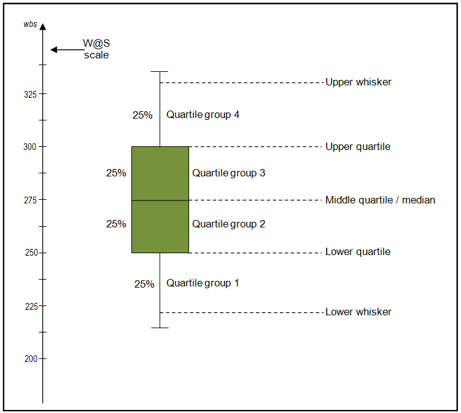
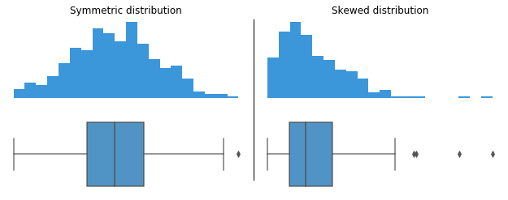

# Praprocessing Data

Dalam **Data Science Life Cycle**, praproses data (data preprocessing) adalah langkah yang krusial untuk memastikan bahwa data yang digunakan untuk analisis atau pengembangan model machine learning sudah bersih, terstruktur, dan relevan. Data Science Life Cycle umumnya terdiri dari beberapa tahap, dan praproses data berada di antara tahap pengumpulan data dan tahap pemodelan. Berikut adalah gambaran umum tentang Data Science Life Cycle dan bagaimana praproses data masuk dalam alur tersebut:

1. **Data Cleaning (Pembersihan Data)**: Menghilangkan data yang tidak valid, menangani missing values, duplikasi, dan outliers.
2. **Data Transformation (Transformasi Data)**: Mengubah format data agar lebih sesuai untuk analisis, seperti normalisasi, encoding data kategorikal, atau melakukan transformasi logaritmik pada distribusi yang tidak normal.
3. **Data Integration (Integrasi Data)**: Menggabungkan beberapa sumber data jika diperlukan.
4. **Data Reduction (Reduksi Data)**: Menyederhanakan data dengan menghapus fitur atau kolom yang tidak relevan, atau menggunakan teknik seperti Principal Component Analysis (PCA) untuk mengurangi dimensi data.
5. **Feature Engineering:** Proses menciptakan fitur baru atau mengubah fitur yang ada untuk membuatnya lebih informatif bagi model machine learning.

Mari untuk memahami seluruh progress data, kita lakukan seluruh proses di atas pada preprocessing file project menggunakan dataset berikut:

https://www.kaggle.com/c/spaceship-titanic/overview

# Explanatory Data Analysis

Tentu! Mari kita sesuaikan materi praproses dengan data yang telah kita gunakan sebelumnya. Berikut adalah contoh penerapan teknik visualisasi data menggunakan Boxplot, Scatter Plot, Heatmap, dan Histogram pada dataset yang berisi informasi penumpang Spaceship Titanic.

### Materi Visualisasi Data: Boxplot, Scatter Plot, Korelasi, Heatmap, dan Histogram

#### 1. **Boxplot**

**Pengertian Boxplot:**  
Boxplot adalah grafik statistik yang menampilkan persebaran data berdasarkan kuartil. Grafik ini membantu mengidentifikasi outlier dan mengetahui penyebaran data.

**Cara Membaca Boxplot:**





- **Median** (Garis tengah kotak): Menunjukkan nilai tengah data.
- **Kotak**: Menunjukkan distribusi antara kuartil pertama (Q1) dan kuartil ketiga (Q3).
- **Whiskers**: Garis yang memperpanjang dari kotak, mewakili data yang tidak dianggap outlier. - **Panjang Whiskers Pendek**: Jika whiskers pendek, ini menunjukkan bahwa data memiliki sebaran yang sempit di luar kuartil, yang berarti sebagian besar nilai data terletak dekat dengan median. - **Panjang Whiskers Panjang:** Jika whiskers panjang, ini menunjukkan bahwa data memiliki sebaran yang lebih luas di luar kuartil, menunjukkan bahwa ada lebih banyak variasi atau nilai ekstrim di luar rentang yang normal.

- **Outlier**: Titik-titik di luar whiskers yang dianggap data ekstrem.

**Kode Python untuk Boxplot:**

```python
import seaborn as sns
import matplotlib.pyplot as plt

# Membuat boxplot untuk Age berdasarkan Transported
sns.boxplot(x='Transported', y='Age_Filled_Mean', data=df)
plt.title('Boxplot of Age by Transported Status')
plt.xlabel('Transported')
plt.ylabel('Age (Mean Filled)')
plt.show()
```

**Cara Membaca Grafik:**

- Melihat rentang nilai (whiskers).
- Membandingkan median antara kategori (Transported).
- Mengidentifikasi apakah terdapat outlier pada usia penumpang.

---

#### 2. **Scatter Plot dan Korelasi**

**Scatter Plot** menggambarkan hubungan antara dua variabel numerik. Dalam konteks dataset ini, kita bisa melihat hubungan antara `RoomService` dan `Total_Spending`.

**Cara Membaca Scatter Plot:**

- **Tidak Berkorelasi**: Titik-titik tersebar secara acak.
- **Korelasi Rendah/Sedang/Tinggi**: Pola lebih jelas; dapat mengidentifikasi kecenderungan naik atau turun.

**Kode Scatter Plot untuk Korelasi:**

```python
# Scatter plot untuk RoomService vs Total Spending
plt.scatter(df['RoomService_Filled_Median'], df['Total_Spending'])
plt.title('Scatter Plot of RoomService vs Total Spending')
plt.xlabel('RoomService (Median Filled)')
plt.ylabel('Total Spending')
plt.show()
```

**Cara Membaca Korelasi:**

- Melihat bagaimana titik-titik tersebar. Apakah ada pola yang menunjukkan hubungan antara pengeluaran di layanan kamar dan total pengeluaran?

---

#### 3. **Heatmap**

**Pengertian Heatmap:**  
Heatmap adalah representasi grafik matriks korelasi antar variabel numerik, dengan warna menunjukkan kekuatan korelasi.

**Kode Python untuk Heatmap:**

```python
# Menghitung korelasi dan membuat heatmap
corr_matrix = df.corr()

# Menggunakan heatmap dari seaborn
sns.heatmap(corr_matrix, annot=True, cmap='coolwarm')
plt.title('Heatmap of Correlation Matrix')
plt.show()
```

**Cara Membaca Heatmap:**

- **-1**: Korelasi negatif sempurna (warna merah).
- **0**: Tidak ada korelasi (warna putih).
- **1**: Korelasi positif sempurna (warna biru).

---

#### 4. **Histogram**

**Pengertian Histogram:**  
Histogram menampilkan distribusi frekuensi dari variabel numerik. Sumbu x menunjukkan rentang nilai, dan sumbu y menunjukkan frekuensi kemunculan.

**Kode Python untuk Histogram:**

```python
# Membuat histogram dari kolom 'Age'
plt.hist(df['Age_Filled_Mean'], bins=10, edgecolor='black')
plt.title('Histogram of Age')
plt.xlabel('Age')
plt.ylabel('Frequency')
plt.show()
```

**Cara Membaca Histogram:**

- **Distribusi Normal**: Grafik berbentuk lonceng, simetris.
- **Distribusi Positif Skewed**: Grafik condong ke kiri (ekor panjang di kanan).
- **Distribusi Negatif Skewed**: Grafik condong ke kanan (ekor panjang di kiri).

---

### Kesimpulan:

- **Boxplot**: Berguna untuk melihat distribusi usia penumpang dan mengidentifikasi outlier berdasarkan status transportasi.
- **Scatter Plot**: Membantu visualisasi hubungan antara pengeluaran layanan kamar dan total pengeluaran.
- **Heatmap**: Digunakan untuk melihat kekuatan korelasi antara variabel-variabel numerik dalam dataset.
- **Histogram**: Menunjukkan distribusi frekuensi usia penumpang.

Masing-masing jenis grafik memiliki peran penting dalam membantu kita memahami data secara visual dan mengidentifikasi pola, hubungan, atau penyebaran yang mungkin tidak terlihat dalam data mentah.

Jika ada pertanyaan lebih lanjut atau bagian lain yang ingin Anda eksplorasi, silakan beri tahu!
