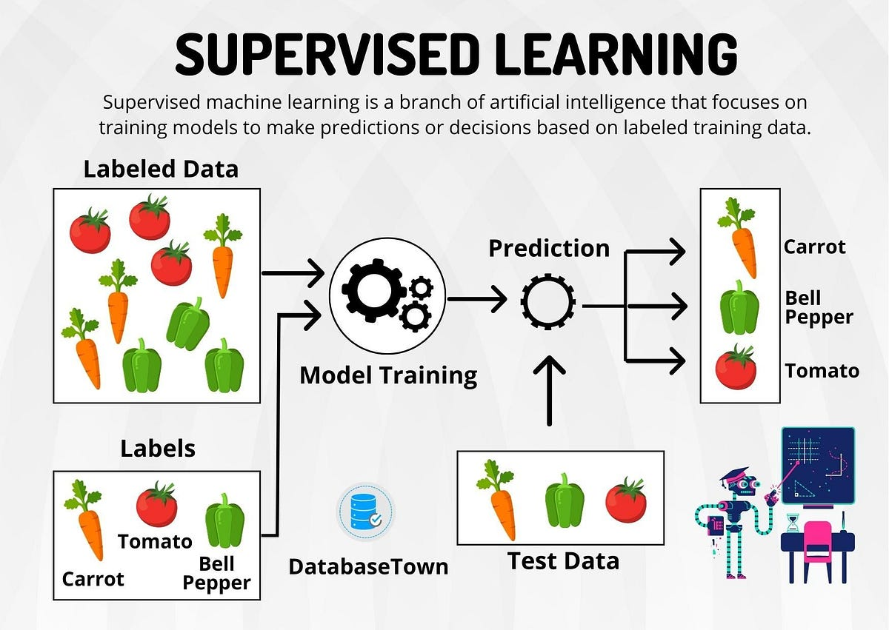

# Machine Learning

## Pengertian Machine Learning

**Machine Learning** adalah cabang dari **Artificial Intelligence (AI)** yang berfokus pada pengembangan algoritma dan model yang memungkinkan komputer atau sistem untuk **belajar** dan **mengambil keputusan** berdasarkan data tanpa harus diprogram secara eksplisit untuk setiap tugas. Inti dari machine learning terletak pada kemampuan sistem untuk menemukan pola atau tren dalam **data historis**, yang kemudian digunakan untuk memprediksi atau membuat keputusan terkait data baru yang serupa.


Berbeda dengan sistem tradisional yang membutuhkan instruksi spesifik untuk setiap fungsi, model machine learning secara otomatis memodifikasi perilakunya berdasarkan **pengalaman yang diperoleh dari data**. Ini mirip dengan cara manusia belajar: ketika seorang anak melihat huruf berkali-kali dan belajar dari kesalahan, ia pada akhirnya akan mampu mengenali huruf tersebut dengan benar. Dalam konteks machine learning, mesin "belajar" dari **dataset** atau sekumpulan besar data yang berisi contoh-contoh yang relevan dan mengidentifikasi hubungan antara berbagai fitur atau karakteristik dalam data tersebut.


Data merupakan komponen paling penting dalam machine learning. Kualitas dan kuantitas data sangat memengaruhi kinerja model. Semakin banyak dan bervariasi data yang dimiliki, semakin baik model dapat mempelajari pola yang ada. Selain itu, data perlu diproses dan dibersihkan untuk menghilangkan noise atau inkonsistensi yang dapat mengganggu pembelajaran model.

Secara garis besar, machine learning mencakup beberapa pendekatan pembelajaran, di antaranya:

1. **Supervised Learning**: Model dilatih menggunakan data yang sudah dilabeli (berisi input-output yang benar). Sistem belajar dari pasangan input-output ini untuk membuat prediksi yang akurat ketika menghadapi data baru.
   
2. **Unsupervised Learning**: Data yang digunakan tidak dilabeli. Sistem harus menemukan pola tersembunyi atau struktur dalam data, seperti klaster atau asosiasi.

3. **Reinforcement Learning**: Sistem belajar melalui umpan balik dari lingkungan. Model menerima reward atau punishment berdasarkan tindakannya, dan secara bertahap belajar untuk memaksimalkan reward tersebut.

Dengan kata lain, machine learning memberikan kemampuan bagi sistem untuk **beradaptasi dan meningkatkan performa** seiring dengan semakin banyaknya data dan pengalaman yang diperolehnya, menjadikannya sangat bermanfaat dalam berbagai bidang seperti pengenalan suara, pengolahan citra, analisis data, dan prediksi tren bisnis.

---

## Tipe Algoritma Machine Learning

Machine learning memiliki berbagai tipe algoritma yang digunakan untuk memecahkan masalah berdasarkan jenis data dan tugas yang ingin diselesaikan. Di bawah ini adalah dua tipe utama dari machine learning: **Supervised Learning** dan **Unsupervised Learning**, lengkap dengan tugas dan contohnya.

### 1. Supervised Learning



**Supervised Learning** adalah tipe machine learning di mana model dilatih menggunakan **data training** yang sudah dilabeli. Artinya, data tersebut memiliki **input (prediktor)** serta **output yang benar**. Algoritma ini bertujuan untuk mengenali pola dari input data dan memprediksi hasil yang sesuai untuk data baru berdasarkan pola yang telah dipelajari.

#### Tugas dalam Supervised Learning
- **Regresi**: Tugas regresi digunakan untuk memprediksi **output numerik** yang bersifat kontinu. Contohnya, prediksi **harga rumah** berdasarkan fitur-fitur seperti lokasi, ukuran, dan tahun bangunan.

  

- **Klasifikasi**: Tugas klasifikasi bertujuan untuk memprediksi **output diskrit** atau kategori. Contoh umum adalah memprediksi apakah seseorang terkena penyakit jantung (ya/tidak) berdasarkan data medis.

  

Dalam supervised learning, model dipandu dengan data yang telah memiliki **jawaban yang benar** sehingga mesin tahu apakah hasil prediksinya benar atau salah selama proses pelatihan. Dengan cara ini, model dapat belajar dan memperbaiki prediksinya pada data baru.

### 2. Unsupervised Learning


**Unsupervised Learning** bekerja pada **data yang tidak berlabel**. Algoritma ini digunakan untuk menemukan **pola tersembunyi atau struktur** dalam data yang tidak memiliki jawaban atau panduan yang jelas. Karena tidak ada output yang diketahui, model tidak memiliki "jawaban benar" untuk dibandingkan, melainkan hanya memproses data untuk menemukan pola yang menarik atau bermanfaat.

#### Tugas dalam Unsupervised Learning:
- **Clustering**: Tugas clustering mengelompokkan data ke dalam beberapa grup berdasarkan kesamaan atau karakteristik tertentu tanpa mengetahui grup tersebut sebelumnya. Contohnya, dalam pemasaran, clustering dapat digunakan untuk mengelompokkan pelanggan berdasarkan kebiasaan belanja mereka.

  

Dalam unsupervised learning, model belajar sendiri dengan menemukan keteraturan atau pola di dalam data tanpa diberi tahu kategori atau label sebelumnya. Algoritma ini berguna untuk eksplorasi data dan menemukan struktur yang tersembunyi di dalam data, seperti pola perilaku konsumen atau segmentasi pasar.

---

## Regression

### Pengertian Regresi dalam Machine Learning
Regresi adalah teknik yang digunakan untuk memodelkan hubungan antara variabel independen (**input**) dan variabel dependen (**output**), dengan tujuan memprediksi nilai **kontinu**.

### Metrik Evaluasi dalam Regresi

Dalam regresi, berbagai metrik evaluasi digunakan untuk mengukur kinerja model prediksi. Metrik-metrik ini membantu untuk memahami seberapa baik model memprediksi nilai output sebenarnya, serta seberapa besar kesalahan prediksi yang dihasilkan. Berikut adalah tiga metrik evaluasi yang paling umum digunakan: **MSE (Mean Squared Error)**, **RMSE (Root Mean Squared Error)**, dan **MAE (Mean Absolute Error)**.

#### 1. **Mean Squared Error (MSE)**


Mean Squared Error (MSE) adalah salah satu metrik kesalahan yang paling umum digunakan untuk mengukur performa model regresi. MSE menghitung rata-rata dari kuadrat perbedaan antara nilai yang diprediksi oleh model (\(y_{\text{pred}}\)) dengan nilai aktual (\(y_{\text{true}}\)).

Rumus MSE:
$$
\text{MSE} = \frac{1}{n} \sum_{i=1}^{n} \left( y_{\text{pred}, i} - y_{\text{true}, i} \right)^2
$$
Di mana:
- \( n \) adalah jumlah total data atau observasi,
- \( y_{\text{pred}, i} \) adalah nilai yang diprediksi untuk observasi ke-i,
- \( y_{\text{true}, i} \) adalah nilai aktual untuk observasi ke-i.

MSE menghukum kesalahan prediksi besar secara lebih kuat dibandingkan kesalahan kecil, karena kuadrat perbedaan digunakan. Ini membuat MSE lebih sensitif terhadap outlier. Jadi, MSE lebih cocok digunakan ketika kita ingin model sangat memperhatikan dan memperbaiki kesalahan-kesalahan besar (outlier).

#### 2. **Root Mean Squared Error (RMSE)**
Root Mean Squared Error (RMSE) adalah akar kuadrat dari MSE, yang bertujuan untuk mengembalikan skala kesalahan ke satuan yang sama dengan data asli. RMSE sangat mirip dengan MSE, namun lebih mudah diinterpretasikan karena hasilnya dalam satuan yang sama dengan target variabel.

Rumus RMSE:
$$
\text{RMSE} = \sqrt{\frac{1}{n} \sum_{i=1}^{n} \left( y_{\text{pred}, i} - y_{\text{true}, i} \right)^2}
$$

RMSE, seperti MSE, sensitif terhadap outlier, karena kuadrat perbedaan antara nilai prediksi dan aktual masih digunakan sebelum pengambilan akar kuadrat.

#### 3. **Mean Absolute Error (MAE)**
Mean Absolute Error (MAE) adalah rata-rata dari selisih absolut antara nilai yang diprediksi dan nilai aktual. Berbeda dengan MSE dan RMSE, MAE tidak menggunakan kuadrat dari kesalahan sehingga setiap kesalahan diperlakukan secara linear, menjadikannya lebih tahan terhadap outlier. 

Rumus MAE:
$$
\text{MAE} = \frac{1}{n} \sum_{i=1}^{n} \left| y_{\text{pred}, i} - y_{\text{true}, i} \right|
$$

MAE memberikan gambaran langsung tentang seberapa besar kesalahan prediksi rata-rata yang terjadi, dan karena tidak mengkuadratkan kesalahan, metrik ini lebih "toleran" terhadap nilai ekstrim dibandingkan MSE atau RMSE.

### Perbandingan dan Penggunaan
- **MSE** dan **RMSE** sangat cocok digunakan ketika kita ingin menghukum kesalahan besar lebih berat dibandingkan kesalahan kecil, karena kesalahan besar memiliki dampak lebih besar dalam perhitungan kuadrat. RMSE sering digunakan untuk menginterpretasikan performa model karena satuannya konsisten dengan nilai target asli.
- **MAE** lebih cocok untuk kasus di mana model prediksi memiliki distribusi kesalahan yang lebih stabil, atau ketika kita tidak ingin kesalahan besar (outlier) memiliki pengaruh yang berlebihan terhadap evaluasi model.

Dalam banyak kasus, baik **RMSE** maupun **MAE** digunakan secara bersamaan untuk memberikan gambaran lebih luas tentang performa model. RMSE biasanya digunakan untuk interpretasi yang lebih sensitif terhadap outlier, sementara MAE memberikan representasi kesalahan yang lebih stabil dan mudah dipahami.

### Kesimpulan
Memilih metrik evaluasi yang tepat sangat bergantung pada tujuan spesifik dari model regresi dan karakteristik data. Apakah tujuan utama adalah mengurangi pengaruh outlier atau hanya mengukur kesalahan prediksi rata-rata, MSE, RMSE, dan MAE memberikan sudut pandang yang berbeda dalam mengevaluasi kualitas prediksi model regresi.


---

### 1. Regresi Linier

**Regresi linier** adalah salah satu metode paling sederhana dan umum digunakan dalam statistik dan machine learning untuk memprediksi nilai dari sebuah variabel target (**Y**) berdasarkan hubungan linear dengan satu atau lebih variabel input (**X**). Regresi linier mencoba menemukan garis lurus yang paling sesuai untuk memodelkan hubungan antara variabel input dan variabel target, sehingga dapat digunakan untuk membuat prediksi di masa depan.

#### Konsep Regresi Linier
Regresi linier berasumsi bahwa hubungan antara variabel independen (**X**) dan variabel dependen (**Y**) dapat direpresentasikan sebagai garis lurus (atau hiperplan untuk lebih dari satu variabel input). Hubungan ini dinyatakan dalam bentuk persamaan linear yang paling sederhana, yaitu:

\[
Y = \beta_0 + \beta_1 X + \epsilon
\]

Di mana:
- \( Y \) = variabel dependen (target atau variabel yang ingin diprediksi),
- \( X \) = variabel independen (variabel input atau fitur yang digunakan untuk prediksi),
- \( \beta_0 \) = intersep (nilai \( Y \) saat \( X = 0 \), juga dikenal sebagai konstanta),
- \( \beta_1 \) = koefisien kemiringan atau slope (mengukur seberapa besar perubahan \( Y \) untuk setiap perubahan unit dalam \( X \)),
- \( \epsilon \) = error atau residu, yaitu selisih antara nilai aktual \( Y \) dengan nilai yang diprediksi oleh model regresi.

#### Rumus Regresi Linier

Dalam regresi linier, tujuan utama adalah untuk menemukan nilai-nilai \( \beta_0 \) dan \( \beta_1 \) yang meminimalkan kesalahan prediksi. Biasanya, ini dilakukan dengan metode **Ordinary Least Squares (OLS)**, yang mencari garis terbaik yang meminimalkan **jumlah kuadrat dari residuals (selisih antara nilai aktual dan prediksi)**.

Untuk model regresi linier sederhana (satu variabel input), persamaannya adalah sebagai berikut:

\[
Y = \hat{\beta}_0 + \hat{\beta}_1 X
\]

Di mana:
- \( \hat{\beta}_0 \) dan \( \hat{\beta}_1 \) adalah nilai koefisien yang diestimasi dari data.

Untuk **regresi linier berganda** (multiple linear regression), di mana terdapat lebih dari satu variabel independen, rumusnya menjadi:

\[
Y = \hat{\beta}_0 + \hat{\beta}_1 X_1 + \hat{\beta}_2 X_2 + \dots + \hat{\beta}_n X_n + \epsilon
\]

Di mana:
- \( X_1, X_2, \dots, X_n \) adalah variabel input (fitur),
- \( \hat{\beta}_1, \hat{\beta}_2, \dots, \hat{\beta}_n \) adalah koefisien regresi untuk masing-masing fitur,
- \( \epsilon \) adalah error atau residual.

#### Interpretasi Koefisien
- **\( \beta_0 \)** (intersep): Menunjukkan nilai \( Y \) ketika semua variabel \( X \) bernilai nol. Ini adalah titik potong garis regresi dengan sumbu \( Y \). Dalam banyak kasus, intersep mungkin tidak memiliki makna interpretasi yang langsung, tetapi tetap penting untuk menghitung persamaan regresi.
  
- **\( \beta_1, \beta_2, \dots, \beta_n \)** (koefisien regresi): Mewakili kemiringan atau pengaruh masing-masing variabel \( X \) terhadap variabel target \( Y \). Secara spesifik, setiap koefisien menunjukkan seberapa besar perubahan pada variabel target \( Y \) untuk setiap perubahan satu unit pada variabel independen \( X \), dengan asumsi variabel lain tetap konstan.

#### Residual dan Sum of Squares
Setelah model regresi linier diestimasi, selisih antara nilai yang diprediksi oleh model (\( \hat{Y} \)) dan nilai sebenarnya (\( Y \)) disebut **residual** (\( \epsilon \)). Untuk menilai seberapa baik model melakukan prediksi, kita biasanya menghitung **jumlah kuadrat dari residual (Sum of Squares of Residuals, SSR)**:

\[
SSR = \sum_{i=1}^{n} (Y_i - \hat{Y}_i)^2
\]

Nilai SSR yang kecil menunjukkan bahwa model regresi memberikan prediksi yang dekat dengan nilai sebenarnya, sementara nilai SSR yang besar menunjukkan bahwa ada banyak variasi antara nilai yang diprediksi dan nilai sebenarnya.

#### Asumsi Regresi Linier
Agar model regresi linier memberikan hasil yang valid, ada beberapa asumsi dasar yang harus dipenuhi:
1. **Linearitas**: Hubungan antara variabel independen dan variabel dependen harus linear.
2. **Independensi**: Residual (kesalahan prediksi) dari pengamatan yang berbeda harus independen satu sama lain.
3. **Homoskedastisitas**: Variansi residual harus konstan untuk semua nilai variabel independen.
4. **Normalitas residual**: Residual harus terdistribusi secara normal.

#### Evaluasi Model
Untuk menilai kinerja model regresi linier, beberapa metrik evaluasi umum digunakan, termasuk:
- **R-squared (R²)**: Mengukur proporsi variansi dalam variabel target yang bisa dijelaskan oleh variabel independen. Nilai \( R^2 \) berkisar antara 0 hingga 1, di mana nilai yang lebih tinggi menunjukkan model yang lebih baik.
- **MSE (Mean Squared Error)**, **RMSE (Root Mean Squared Error)**, dan **MAE (Mean Absolute Error)**: Metrik yang mengukur seberapa besar kesalahan prediksi yang dihasilkan oleh model.

#### Kesimpulan
Regresi linier adalah metode yang sangat efektif untuk memodelkan hubungan linear antara variabel. Meskipun sederhana, model ini sering digunakan sebagai pendekatan dasar dalam berbagai masalah prediksi. Namun, untuk mendapatkan hasil yang akurat, penting untuk memastikan bahwa asumsi-asumsi regresi linier terpenuhi dan memahami batasannya, terutama ketika menghadapi data dengan pola non-linear atau outlier yang kuat.


#### Contoh Kode Implementasi Regresi Linier Sederhana
```python
# Import libraries untuk visualisasi dan evaluasi
import numpy as np
import matplotlib.pyplot as plt
from sklearn.model_selection import train_test_split
from sklearn.linear_model import LinearRegression
from sklearn.metrics import mean_squared_error, r2_score, mean_absolute_error

 #Data sederhana (ukuran rumah dan harga rumah)
X = np.array([50, 60, 70, 80, 90, 100, 110, 120, 130, 140]).reshape(-1, 1)  # Ukuran rumah
y = np.array([150, 160, 175, 180, 200, 210, 220, 230, 245, 260])  # Harga rumah

 #Membagi dataset menjadi data latih dan uji
X_train, X_test, y_train, y_test = train_test_split(X, y, test_size=0.2, random_state=42)

#Membuat model regresi linear
model_linear = LinearRegression()

#Melatih model
model_linear.fit(X_train, y_train)

 #Prediksi pada data uji
y_pred_test = model_linear.predict(X_test)   #Prediksi pada data uji

 #Visualisasi hasil regresi linear pada seluruh dataset
plt.scatter(X, y, color='blue', label='Data Asli')
plt.plot(X, model_linear.predict(X), color='red', label='Regresi Linear')
plt.title('Regresi Linear: Ukuran Rumah vs Harga Rumah')
plt.xlabel('Ukuran Rumah (m^2)')
plt.ylabel('Harga Rumah (juta)')
plt.legend()
plt.grid(True)
plt.show()

 #Evaluasi model
mse = mean_squared_error(y_test, y_pred_test)  # Mean Squared Error
rmse = np.sqrt(mse)   #Root Mean Squared Error
mae = mean_absolute_error(y_test, y_pred_test)  #Mean Absolute Error
r2 = r2_score(y_test, y_pred_test)   #R-squared

 #Output hasil
print("Mean Squared Error (MSE) pada data uji:", mse)
print("Root Mean Squared Error (RMSE) pada data uji:", rmse)
print("Mean Absolute Error (MAE) pada data uji:", mae)
print("R-squared (R2) pada data uji:", r2)
print("Koefisien (slope):", model_linear.coef_[0])
print("Intercept:", model_linear.intercept_)

```
---

### 2. Multiple Linear Regression

**Multiple Linear Regression** memperluas regresi linier sederhana dengan menggunakan lebih dari satu variabel independen.

#### Rumus Multiple Linear Regression


#### Contoh Implementasi Multiple Linear Regression

 

---

### 3. Regresi Logistik

Regresi logistik digunakan ketika variabel dependen bersifat **kategori** (misalnya, 0 atau 1). Meskipun disebut regresi, teknik ini lebih mirip dengan klasifikasi karena hasil yang diinginkan adalah **probabilitas** sebuah data masuk dalam kelas tertentu.


#### Contoh Implementasi Regresi Logistik

```python
import numpy as np
import matplotlib.pyplot as plt
from sklearn.model_selection import train_test_split
from sklearn.linear_model import LogisticRegression
from sklearn.metrics import accuracy_score, confusion_matrix, classification_report

# Data sederhana
X = np.array([[45], [50], [55], [60], [65], [70], [75], [80], [85], [90], [95], [100]])
y = np.array([0, 0, 0, 0, 1, 0, 1, 1, 1, 1, 1, 1])

# Membagi dataset
X_train, X_test, y_train, y_test = train_test_split(X, y, test_size=0.2, random_state=42)

# Membuat model regresi logistik
model_logistik = LogisticRegression()
model_logistik.fit(X_train, y_train)

# Prediksi pada data uji
y_pred_logistik = model_logistik.predict(X_test)

# Visualisasi kurva regresi logistik
probabilitas = model_logistik.predict_proba(X)[:, 1]
plt.scatter(X, y, color='blue', label='Data Asli')
plt.plot(X, probabilitas, color='red', label='Kurva Regresi')
plt.show()

# Evaluasi model
accuracy = accuracy_score(y_test, y_pred_logistik)
conf_matrix = confusion_matrix(y_test, y_pred_logistik)
class_report = classification_report(y_test, y_pred_logistik)

print("Accuracy:", accuracy)
print("Confusion Matrix:\n", conf_matrix)
print("Classification Report:\n", class_report)
```

---

### 4. Perbandingan Regresi Linier dan Logistik

- **Regresi Linier** memprediksi nilai numerik, sedangkan **Regresi Logistik** memprediksi probabilitas suatu kejadian.
- **Regresi Logistik** lebih cocok untuk variabel dependen yang bersifat biner, sedangkan **Regresi Linier** digunakan untuk variabel dependen yang kontinu.
