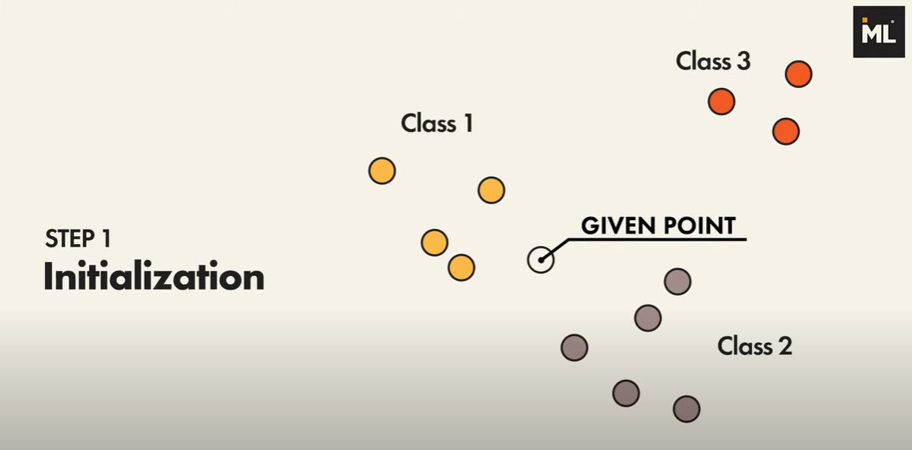
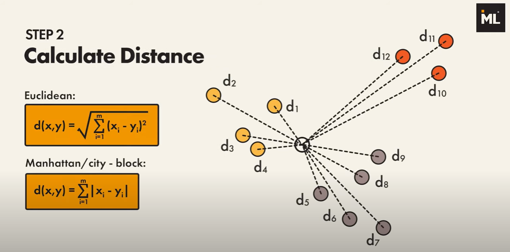
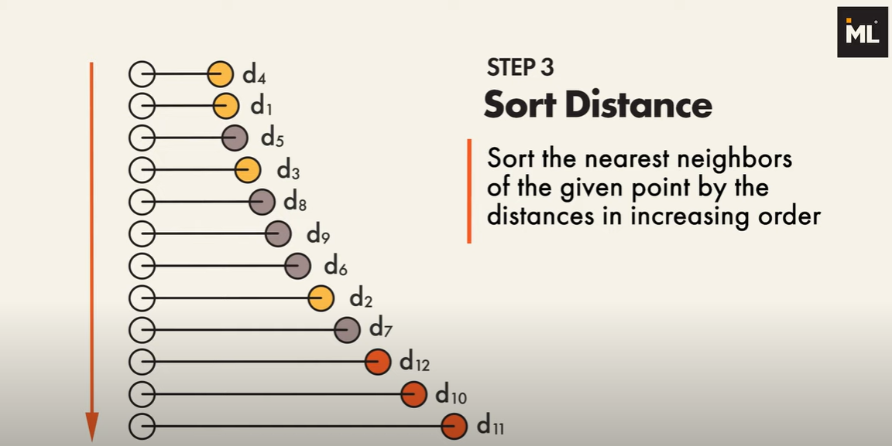
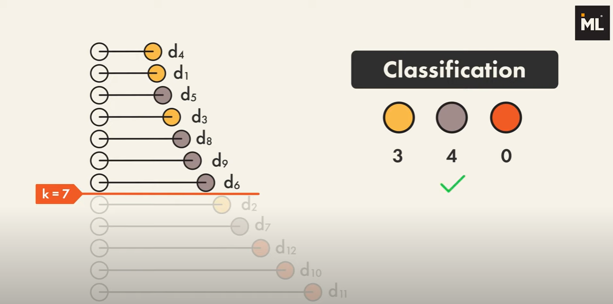

# Classification (Klasifikasi)

# 1. K-Nearest Neighbors (K-NN) Classifier
K-Nearest Neighbors (K-NN) adalah salah satu algoritma supervised learning yang paling sederhana namun efektif untuk klasifikasi dan regresi. Algoritma ini bekerja dengan **asumsi bahwa data yang mirip akan berada dalam jarak yang dekat satu sama lain**. Secara umum, K-NN sering digunakan untuk masalah klasifikasi, namun dapat juga diterapkan dalam regresi. Berikut ini adalah pembahasan mendetail tentang K-NN.

## 1.1 Langkah Kerja K-NN
Proses kerja algoritma K-NN adalah sebagai berikut:

1. **Penyimpanan Data Pelatihan:** K-NN menyimpan seluruh data pelatihan untuk digunakan saat ada data uji baru.

2. **Hitung Jarak:** Untuk setiap instance data baru (data uji), algoritma menghitung jarak antara data uji tersebut dengan semua instance di data pelatihan.

3. **Temukan K Tetangga Terdekat:** Dari hasil perhitungan jarak, algoritma memilih K data terdekat dari data pelatihan.

4. **Mayoritas Voting (untuk klasifikasi):** Dalam kasus klasifikasi, algoritma akan menentukan kelas dari data uji berdasarkan mayoritas kelas dari K tetangga terdekat.

### 1.2 **Kelebihan dan Kekurangan K-Nearest Neighbors (K-NN)**

Agar lebih mudah dipahami, berikut penjelasan mengenai kelebihan dan kekurangan K-NN dengan menggunakan bahasa yang lebih sederhana:

### A. **Kelebihan K-NN:**

1. **Mudah Dimengerti dan Diimplementasikan**
   - K-NN adalah salah satu algoritma yang paling mudah dipahami dalam dunia machine learning. Kamu hanya perlu mencari "tetangga terdekat" dari data baru berdasarkan jarak. Tanpa perhitungan rumit, cukup hitung jarak dan lihat tetangga yang terdekat.

2. **Tidak Perlu Melatih Model**
   - K-NN tidak membutuhkan proses pelatihan model yang kompleks. Algoritma ini langsung menyimpan data pelatihan dan baru bekerja saat ada data baru yang ingin diprediksi. Jadi, kamu tidak perlu melakukan perhitungan rumit untuk membuat model terlebih dahulu.

3. **Fleksibel untuk Berbagai Jenis Data**
   - K-NN tidak membuat asumsi apa pun tentang bentuk atau distribusi data, sehingga algoritma ini bisa digunakan pada berbagai jenis dataset, baik yang linear, non-linear, atau bahkan dataset yang tidak terstruktur.

4. **Bekerja dengan Baik untuk Data Kecil**
   - K-NN cenderung bekerja sangat baik untuk dataset yang tidak terlalu besar karena tidak butuh banyak perhitungan selama datasetnya masih kecil.

### B. **Kekurangan K-NN:**

1. **Lambat pada Dataset Besar**
   - Jika dataset terlalu besar, K-NN menjadi lambat karena harus menghitung jarak antara data baru dan **semua** data pelatihan untuk menentukan tetangga terdekat. Ini bisa memakan waktu lama dan membutuhkan banyak memori komputer.

2. **Sensitif terhadap Noise**
   - Data yang tidak relevan atau data yang salah (noise) dapat sangat mempengaruhi hasil prediksi. Jika ada outlier (data yang jauh berbeda dari pola lainnya), K-NN bisa salah dalam menentukan kelas atau nilai prediksi.

3. **Memori yang Besar**
   - Karena K-NN menyimpan seluruh data pelatihan untuk digunakan saat ada prediksi, algoritma ini bisa membutuhkan memori yang besar, terutama jika datasetnya sangat besar.

4. **Performa Tergantung pada Skala Fitur**
   - K-NN menghitung jarak antara data, sehingga fitur (variabel) dengan skala yang berbeda bisa mendominasi hasil perhitungan. Misalnya, jika satu fitur memiliki rentang nilai yang jauh lebih besar daripada fitur lain, itu akan mendominasi jarak. Oleh karena itu, fitur-fitur perlu dinormalisasi atau di-standardisasi agar performa K-NN lebih baik.

5. **Tidak Cocok untuk Dimensi Tinggi (Curse of Dimensionality)**
   - Jika data memiliki banyak fitur atau variabel (dimensi tinggi), K-NN bisa kesulitan menemukan pola yang relevan. Semakin banyak fitur, semakin sulit untuk menghitung jarak yang benar-benar mencerminkan kemiripan antar data.

   
# 2. Naive Bayes Classifier
Naive Bayes adalah salah satu algoritma supervised learning yang sering digunakan untuk tugas klasifikasi. Algoritma ini didasarkan pada **Teorema Bayes**, yang merupakan teorema dasar dalam probabilitas, dengan asumsi kuat (naive) bahwa **semua fitur atau variabel dalam dataset adalah independen satu sama lain**, yang dalam kenyataannya mungkin tidak benar, namun memberikan hasil yang sangat baik dalam praktik.

### **Dasar dari Naive Bayes: Teorema Bayes**

Naive Bayes didasarkan pada **Teorema Bayes**, yang menghitung probabilitas suatu kejadian berdasarkan pengetahuan sebelumnya tentang kondisi yang mungkin terkait dengan kejadian tersebut.

#### **Teorema Bayes**

Teorema Bayes menyatakan:

$$
\
P(A|B) = \frac{P(B|A) \cdot P(A)}{P(B)}
\
$$

Dimana:
- $$\( P(A|B) \$$) adalah probabilitas terjadinya kejadian A, diberikan bahwa B terjadi (probabilitas posterior).
- $$\( P(B|A) \$$) adalah probabilitas terjadinya kejadian B, diberikan bahwa A terjadi (likelihood).
- $$\( P(A) \$$) adalah probabilitas terjadinya kejadian A (probabilitas prior).
- $$\( P(B) \$$) adalah probabilitas terjadinya kejadian B (probabilitas evidence).

Dalam konteks **klasifikasi**, kita mencoba menghitung probabilitas suatu kelas $$\( C \$$) terjadi berdasarkan beberapa fitur atau atribut $$\( X_1, X_2, ..., X_n \$$) yang kita miliki.

---

### **Konsep Naive Bayes dalam Klasifikasi**

Pada klasifikasi menggunakan Naive Bayes, kita ingin menentukan probabilitas sebuah data $$\( X = (X_1, X_2, ..., X_n) \$$) termasuk dalam suatu kelas $$\( C \$$). Untuk melakukan ini, kita menghitung probabilitas bersyarat $$\( P(C|X) \$$), yaitu probabilitas kelas $$\( C \$$) terjadi mengingat data $$\( X \$$).

Menggunakan Teorema Bayes, kita dapat menghitung probabilitas posterior $$\( P(C|X) \$$) sebagai berikut:

\[
P(C|X) = \frac{P(X|C) \cdot P(C)}{P(X)}
\]

- **$$\( P(C|X) \$$)**: Probabilitas bahwa kelas $$\( C \$$) terjadi, diberikan fitur $$\( X \$$) (posterior).
- **$$\( P(X|C) \$$)**: Probabilitas fitur $$\( X \$$) terjadi, diberikan kelas $$\( C \$$) (likelihood).
- **$$\( P(C) \$$)**: Probabilitas kelas $$\( C \$$) terjadi tanpa mempertimbangkan fitur (probabilitas prior).
- **$$\( P(X) \$$)**: Probabilitas keseluruhan dari fitur $$\( X \$$) (probabilitas evidence).

Karena kita hanya tertarik pada perbandingan antara kelas $$\( C \$$) yang berbeda, kita bisa mengabaikan $$\( P(X) \$$) karena sama untuk semua kelas. Jadi, rumusnya menjadi:

\[
P(C|X) \propto P(X|C) \cdot P(C)
\]

---

### **Asumsi "Naive" pada Naive Bayes**

Naive Bayes membuat asumsi bahwa semua fitur $$\( X_1, X_2, ..., X_n \$$) **saling independen** satu sama lain, artinya kejadian satu fitur tidak mempengaruhi fitur lainnya. Ini adalah asumsi yang sangat sederhana dan seringkali tidak benar dalam praktik, tetapi tetap memberikan hasil yang bagus dalam banyak kasus.

Dengan asumsi ini, kita bisa menghitung $$\( P(X|C) \) sebagai:

\[
P(X|C) = P(X_1|C) \cdot P(X_2|C) \cdot ... \cdot P(X_n|C)
\]
